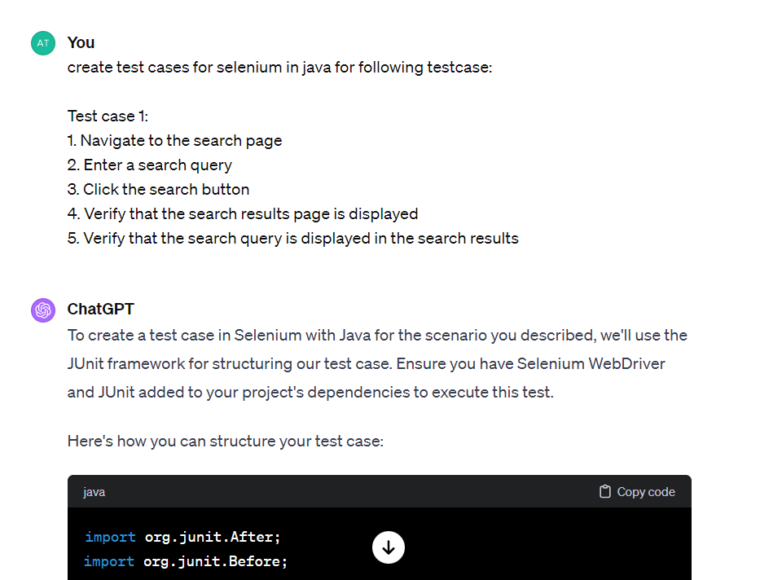

Lab: ChatGPT to generate test cases and test scripts for automated testing
==========================================================================


ChatGPT is an AI-based language model that can be used to generate test
cases and scripts for automated testing. While it is not a replacement
for a human tester, it can be used to augment and accelerate the testing
process.

Here's an example of how you can use ChatGPT to generate test cases and
Selenium test scripts:

Step 1: **Identify the test scenario**: Before writing any code, you
need to have a clear idea of what you want to test. This could be a
specific user interaction, a functional flow, or an end-to-end scenario.
Once you have identified the scenario, break it down into smaller steps
that can be automated using Selenium. Let's say you want to test the
search functionality of a website.

Step 2: **Choose a programming language**: Selenium can be used with a
variety of programming languages, including Java, Python, and C\#.
Choose a language that you are familiar with or that your team is using.

Step 3: **Set up your development environment**: You'll need to install
the Selenium WebDriver library and the programming language's specific
bindings. This will enable you to interact with the web browser and
automate your tests.

Step 4: **Input the scenario to ChatGPT**: Open a chat window or
interface with ChatGPT and provide the details of the scenario you want
to test. For example, you might type, "I want to test the search
functionality of a website. Can you generate some test cases for me?"

Step 5: **ChatGPT generates test cases**: ChatGPT will analyze your
request and generate test cases based on the input you provided. Here's
an example of a test case generated by ChatGPT:

```
Test case 1: 
1. Navigate to the search page
2. Enter a search query
3. Click the search button
4. Verify that the search results page is displayed
5. Verify that the search query is displayed in the search results
```

Step 6: **Convert the test case into a Selenium test script (Java)**:
Using the test case generated by ChatGPT, you can create a Selenium Java
test script that automates the steps of the test case. Here's an example
of a Selenium Java test script for the test case generated above:




```
import org.junit.After;
import org.junit.Before;
import org.junit.Test;
import org.openqa.selenium.By;
import org.openqa.selenium.WebDriver;
import org.openqa.selenium.WebElement;
import org.openqa.selenium.chrome.ChromeDriver;

import static org.junit.Assert.assertTrue;

public class SearchPageTest {
    private WebDriver driver;

    @Before
    public void setUp() {
        // Set the path to your chromedriver.exe
        System.setProperty("webdriver.chrome.driver", "path/to/your/chromedriver.exe");
        // Initialize the ChromeDriver
        driver = new ChromeDriver();
    }

    @Test
    public void testSearchFunctionality() {
        // Step 1: Navigate to the search page
        driver.get("https://www.example.com/search");

        // Step 2: Enter a search query
        WebElement searchBox = driver.findElement(By.id("searchBox")); // Replace "searchBox" with the actual ID of the search input field
        searchBox.sendKeys("selenium");

        // Step 3: Click the search button
        WebElement searchButton = driver.findElement(By.id("searchButton")); // Replace "searchButton" with the actual ID of the search button
        searchButton.click();

        // Step 4: Verify that the search results page is displayed
        // This can be specific to the website. Here, we assume the presence of a result element indicates success.
        WebElement results = driver.findElement(By.id("results")); // Replace "results" with the actual ID of the search results container
        assertTrue(results.isDisplayed());

        // Step 5: Verify that the search query is displayed in the search results
        // This check can be specific. For instance, checking if the title or URL of a result contains the query.
        // Here's a simple way to check if the search query is present in the results container's text.
        assertTrue(results.getText().contains("selenium"));
    }

    @After
    public void tearDown() {
        // Close the browser
        driver.quit();
    }
}
```


Using ChatGPT to generate test cases can help you save time and effort
in the testing process. However, it's important to review and validate
the test cases generated by ChatGPT to ensure they are accurate and
complete.

Note: This is just a basic example, and there are many more features and
functionalities available in Selenium to make your test scripts more
robust and comprehensive.
