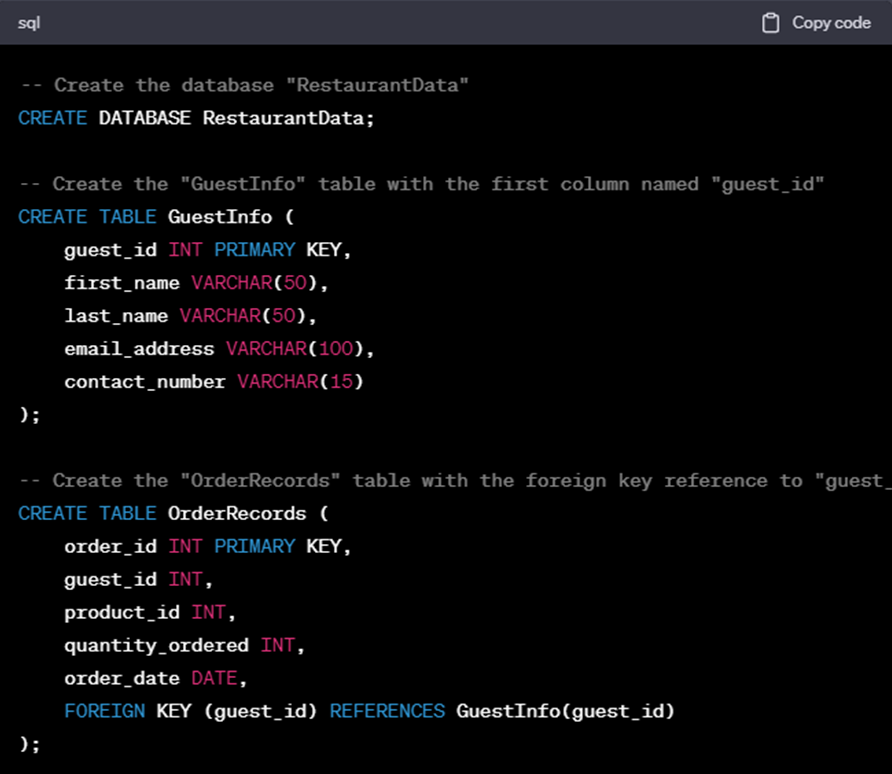

### Lab: ChatGPT to Write SQL queries for Test Automation

Once you have a basic understanding of SQL, you can start using ChatGPT
to write SQL queries. To do this, you need to provide ChatGPT with a
description of the query that you want to write. After that, ChatGPT
will generate the SQL code for you.

For example, you could just give ChatGPT the query below to write an SQL query to select all of the customers in your database.

#### Select all of the customers in my database

Following that, ChatGPT will provide the SQL code shown below:

    SELECT * FROM customers;

The customer table\'s entire set of columns will be selected by this
query. Additionally, ChatGPT can be used to create more complex SQL
statements.

### Use ChatGPT to Describe Your Intentions

Now let's have a look at some examples where we will ask ChatGPT to
generate SQL code by asking it queries from our side.

**For Example:**

We\'ll be creating a sample database for ChatGPT, so we can ask them to
set up restaurant databases and two tables.

**ChatGPT prompt:**

    Create a sample database with two tables: GuestInfo and OrderRecords. The GuestInfo table should have the following columns: guest_id, first_name, last_name, email_address, and contact_number. The OrderRecords table should have the following columns: order_id, guest_id, product_id, quantity_ordered, and order_date.

**ChatGPT SQL Query Output:**



We requested that ChatGPT create a database and two tables in this
example.


### How ChatGPT Can Be Used for Optimizing, Crafting, and Debugging Your Queries

SQL is an efficient tool to manipulate and interrogate data in the
database. However, in particular, for very complex datasets it may be
difficult to write efficient SQL queries. The ChatGPT Language Model is
a robust model to help you with many tasks, such as optimizing SQL
queries.

#### Generating SQL queries

The creation of SQL queries from Natural Language Statements is one of
the most common ways that ChatGPT can be used for SQL optimization.
Users who don\'t know SQL may find this helpful, as well as users who
want to quickly create the query for a specific task.

For example, you could ask for ChatGPT in the following way:

**Generate an SQL query to select all customers who have placed an order
in the last month.**

ChatGPT would then generate the following query:

    SELECT *
    FROM customers
    WHERE order_date >= CURRENT_DATE - INTERVAL 1 MONTH;

#### Optimizing existing queries

The optimization of current SQL queries can also be achieved with
ChatGPT. You can do this by giving ChatGPT the query that you want
improved performance of and it will then suggest improvements to your
query.

For example, you could ask for ChatGPT in the following way:

    SELECT *
    FROM products
    WHERE product_name LIKE '%shirt%';

ChatGPT might suggest the following optimizations:

-   Add an index to the **products** table on the **product\_name**
    column.
-   Use a full-text search index on the **product\_name** column.
-   Use a more specific LIKE clause, such as **WHERE product\_name =
    \'shirt\'** if you know that the product name will be an exact
    match.

#### Crafting queries

By providing an interface between SQL and Natural Language, ChatGPT will
be able to help with the drafting of complicated SQL queries. For users
who are not familiar with SQL and need to create a quick query for a
specific task, it can be helpful.

**For Example:**

Let\'s say we want to know which customers have placed an order within
the last month, and spent more than \$100 on it, then write a SQL query.
The following query could be generated by using ChatGPT:

    SELECT *
    FROM customers
    WHERE order_date >= CURRENT_DATE - INTERVAL 1 MONTH
    AND order_total > 100;

This query is relatively easy to perform, but ChatGPT can also be used
for the creation of more complicated queries. For example, to select all
customers who have placed an order in the last month and who have
purchased a specific product, we could use ChatGPT to generate a query.

    SELECT *
    FROM customers
    WHERE order_date >= CURRENT_DATE - INTERVAL 1 MONTH
    AND order_items LIKE '%product_name%';

Generating queries for which more than one table is involved can also be
done with ChatGPT. For example, to select all customers who have placed
an order in the last month and have also purchased a specific product
from a specific category, we could use ChatGPT to generate a query.

```
SELECT customers.*
FROM customers
INNER JOIN orders ON customers.id = orders.customer_id
INNER JOIN order_items ON orders.id = order_items.order_id
WHERE order_date >= CURRENT_DATE - INTERVAL 1 MONTH
AND order_items_product_id = (SELECT id FROM products WHERE product_name = 'product_name')
AND product_category_id = (SELECT id FROM product_categories WHERE category_name = 'category_name');
```


The ChatGPT tool is capable of providing assistance with the creation of
complex SQL queries. The ChatGPT feature facilitates users\' writing
efficient and accurate queries by providing an interface to SQL in a
natural language.

#### Debugging SQL queries

For debugging SQL queries, the ChatGPT can also be used. To get started,
you can ask ChatGPT to deliver a query that does not return the
anticipated results. It will try to figure out why this is happening.

For example, you could ask for ChatGPT in the following way:

    SELECT *
    FROM customers
    WHERE country = 'United States';

Let\'s say that more results than expected are returned by this query.
If there are multiple rows in a customer table, or the country column
isn\'t being populated correctly for all clients, ChatGPT may suggest
that something is wrong.

### How ChatGPT can help diagnose SQL query errors and suggest potential fixes

You may find that ChatGPT is useful for diagnosing and identifying
problems, as well as suggesting possible remedies when you encounter
errors or unexpected results in your SQL queries.

To illustrate how ChatGPT could help you diagnose and correct SQL
queries, we\'ll go over a hands-on example.

**Scenario:** You\'ll be working with a database for Internet store
transactions. The \'Products\' table is where you would like to see the
total revenue from a specific product named \"Laptop\". But you\'ll get
unexpected results while running a SQL query.

**Your SQL Query:**

    SELECT SUM(price) AS total_revenue
    FROM Products
    WHERE product_name = 'Laptop';

 **Issue:** The query is not providing the expected results. You\'re not
sure what went wrong.

**ChatGPT Assistance:**

**Diagnosing the Issue:**

You can ask ChatGPT something like, \"**What could be the issue with my
SQL query to calculate the total revenue of \'Laptop\' from the Products
table?**\"

**ChatGPT's Response:**

The ChatGPT believes that the problem may arise from a WHERE clause. It
suggests that because the names of products may not be distinctive, and
there might be a lot of entries called \'Laptops\', it is suggested to
use ProductID rather than the product name. This query could be modified
as follows:

    SELECT SUM(price) AS total_revenue
    FROM Products
    WHERE product_id = (SELECT product_id FROM Products WHERE product_name = 'Laptop');

**Explanation and Hands-on Practice:**

The reasoning behind this adjustment is explained by ChatGPT. In order
to check if the revised query is likely to lead to an expected overall
profit for a \'Laptop\' product, you can then try running it.

    SELECT SUM(price) AS total_revenue
    FROM Products
    WHERE product_id = (SELECT product_id FROM Products WHERE product_name = 'Laptop');

We have obtained the correct overall revenue from a \'Laptop\' product
with this query, which has resolved your unanticipated results issue.

This hands-on example demonstrates how ChatGPT can help you diagnose and
resolve your SQL problems, provide tailored suggestions, explain the
solutions to fix them, and guide you through the process of
strengthening your SQL skills by using practical applications.

Conclusion
----------

In conclusion, this lab provides insight into the important role
that ChatGPT plays when it comes to generating efficient SQL queries. In
view of the key role played by SQL in database management for structured
data, which is essential to modern applications, it stressed that there
should be a solid knowledge base on SQL so as to effectively use ChatGPT
when creating queries. We explored how ChatGPT could help you
**generate**, **optimize,** and **analyze** SQL queries by presenting
practical examples and use cases.
