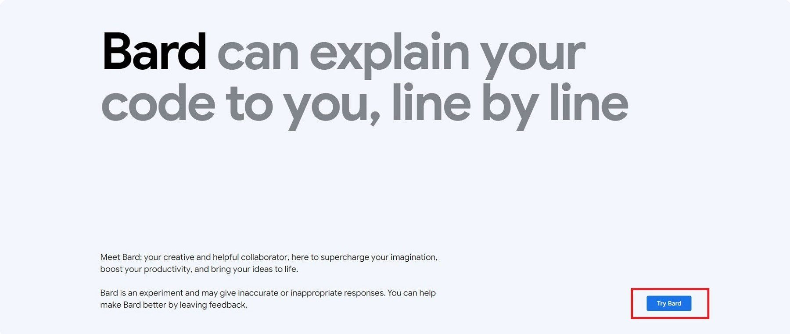
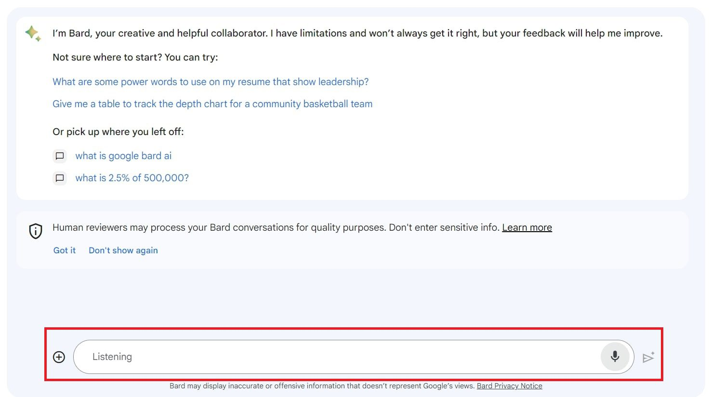
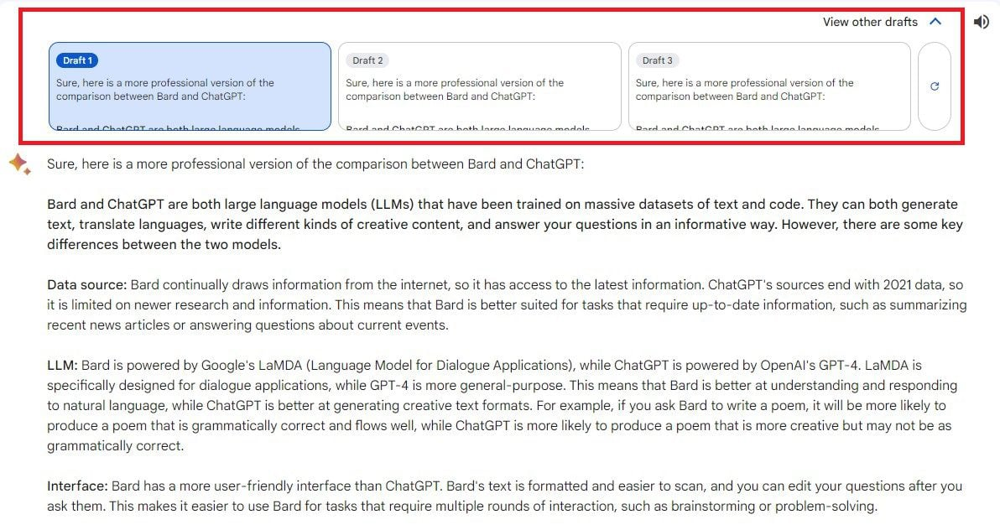
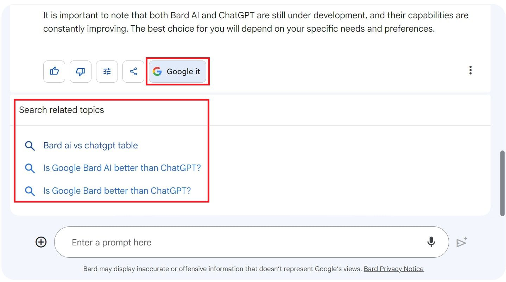
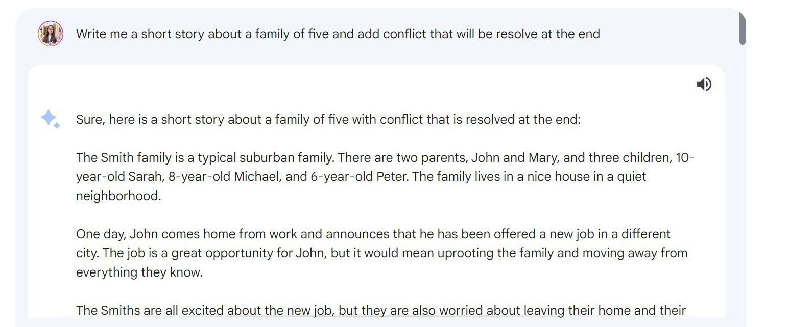
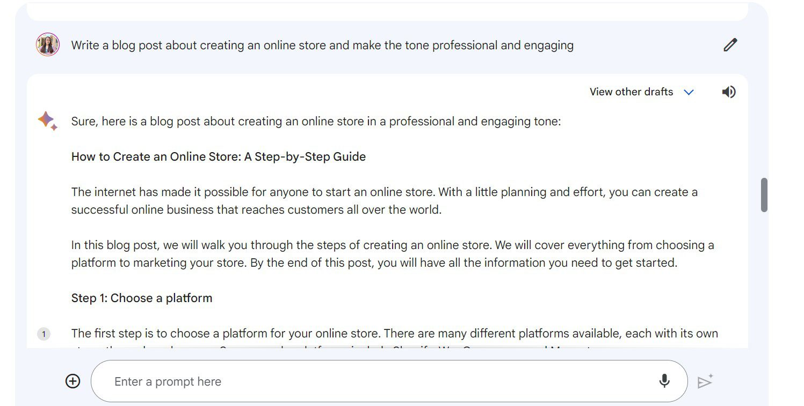

Lab: Use Google Bard for Automation
===================================

Artificial intelligence (AI) is
changing how we work now. You have probably tried using ChatGPT already,
but there are other similar AI chatbots like Google Bard AI that you can
use in your daily life and at work.

In this lab, we'll explore Google Bard AI's capabilities and
limitations, we'll also provide a step-by-step guide on using this
chatbot. We will also discuss the future of Bard AI and how to use it
responsibly.

What Is Google Bard AI
------------------------

Google Bard AI is a conversational AI chatbot
by Google that can help us generate different kinds of text. Bard AI is
still experimental but trained on a massive dataset of text and code to
generate text, translate languages, write different kinds of creative
content, and answer your questions in an informative way.

### Google Bard Ai-Language Model

Google Bard AI is powered by a large language model (LLM), a version of
LaMDA when it was first launched. With its latest update, Google Bard AI
now uses the Pathways Language Model (PaLM 2), which allows it to be
more efficient and perform better.

### Google Bard AI's Interface

Google Bard AI is known to have a user-friendly interface.

Its formatted text makes it easier to read and scan results. You can
also see a list of recent chats, making it accessible to go back to old
conversations if you need that information. Google Bard AI can also give
the latest and most recent news and information.

Another feature that makes it user-friendly is the "Google It" button,
which suggests topics based on your questions, making learning more
about your topic easier. You'll be redirected to a traditional Google
search once you click Bard's suggested topics or questions.

How To Use Google Bard AI?
--------------------------------------------------------

Google Bard AI is a powerful tool that can assist us in various tasks,
from generating text to answering our questions. This guide will walk
you through the steps to maximize Bard's features and get the desired
results.

### 1. Accessing Google Bard AI

Go to [bard.google.com](https://bard.google.com/) and **Sign in** using
your Google account to start navigating the Google Bard AI interface.

### 2. Starting Your First Chat With Google Bard AI

At the bottom of the screen, click **"Enter a prompt here"** and type
your questions to start your first conversation with Google Bard AI.
Bard will offer suggestions to help you figure out what to ask.

If you don't want to type your question, you can **click the microphone
button **to ask your questions, and Bard will listen and type what you
speak.

**Click the pencil picture **in the top-right corner to edit and change
your question. Once changed, Bard will give us a new answer based on
what you edit.

**Click the plus button** in the left part of the prompt box to upload a
photo and ask your queries about the picture you uploaded.

Google Bard AI also comes with three drafts or formats. You can select
which one aligns with your desired results.

### 3. Using Follow-up Questions

After Google Bard AI generates results for your first prompt, you can
always ask follow-up questions until you get the best answer to your
question.

Click **thumbs up** if Bard's response is good and **thumbs down** if
bad. By doing this, we are helping Bard to improve since it is still
experimental.

You can **click the Google It button** for more insight regarding your
queries. When you click the related search suggested by Google Bard AI,
it will redirect you to the Google web page. This feature is only
available with this language model because it is from Google.

### 4. Sharing and Exporting Your Results]

With the latest update of Google Bard, we can now publicly share a link
to the prompt and response or even the entire chat to a third-party
service.

Click the **Share button** and choose whether to share a specific prompt
& response or the entire chat.

Next, click **Create Public link.**

Then, choose from **Linkedin, Facebook, Twitter, and Reddit** to share
the created public link.

Click **Export to Sheets** if you want Google Bard AI to directly export
the table to Google Sheets.

Aside from exporting the table to Google Sheets, Google Bard AI can also
export the results to documents, basically a Google doc.

Click **Export to Docs to** directly export information to Docs.

Aside from exporting to Sheets and Docs, Google Bard AI now lets you
export Python code to Replit and Google Colab. Once you **click Export
to Colab **or **Export to Replit, **it will redirect you to their
webpage.

### 5. Drafting Email in Gmail

Google Bard AI also lets you edit emails inside Gmail. **Click Draft in Gmail**, and Bard AI will ask you to open it in Gmail.

Click **Open Gmail** to redirect to Gmail.

Then, you can edit the information inside your Gmail and send it to any
recipient.

### 6. Using Pinned and Recent Threads

Use **Recent Threads** to check your old Bard conversations.

You can also **pin, rename, or delete** your previous conversations with
Google Bard AI.

What Can Google Bard AI Do
---------------------------

Google Bard AI offers assistance across a variety of tasks. Whether
you're an experienced creative writer, a digital marketer, or a web
developer, integrating Bard AI into your workflow can simplify tasks.

Here are 8 ways in which Bard AI can enhance your creativity and
optimize the time you spend on your tasks.

### 1. Answer Questions

We often ask questions, and it takes us time to research and find
answers because we need to check each piece of information Google
presents on the search engine. Google Bard AI differs from the usual
Google search because it is more conversational when answering our
questions. Instead of presenting us with links, it'll present us with a
direct response.

### 2. Follow-up Questions

When we are having a conversation with someone, we often ask follow-up
questions for clarification. Even in Google Bard AI, we usually have
that follow-up question in mind after it generates an initial result.

We can always follow-up questions in Bard AI to make the results more
transparent and comprehensive. Bard can remember the previous queries
and correlate follow-up questions to them.

### 3. Summarize Articles

Reading long articles or content can sometimes be tedious, especially if
we only want the summary of the content we are reading.

Google Bard AI helps us summarize articles by taking the main ideas from
any article and showing the results through easy-to-understand concepts.

As you can see above, we inserted the link to the article and asked Bard
to summarize it. Then, Bard AI gave us a short article version we can
read, copy, or take elsewhere.

This is something helpful for a researcher, student, or worker who needs
to understand an extensive article quickly.

### 4. Create Creative Content

We can use Google Bard AI to help us write essays, poems, songs, movie
stories, blogs, video scripts, and more. Bard can generate video
scripts, but it can not create a video. 

We can also put in something we have already written and ask Bard AI to
improve, change the words, or finish it.

### 5. Show Differences Between Research and Data Using a Chart

Another remarkable feature of Google Bard AI is its ability to compare
online content. For instance, we will use it to compare news articles
about the same subject.

Bard AI creates a chart that displays the similarities and differences
between the two articles, showing what each piece focuses on and its
perspective.

### 6. Generate Ads Copy Ideas

If you're a copywriter, it is sometimes hard to get an idea for your
next ad campaign.

Google Bard AI, like any other AI writing software
can help generate advertising copy ideas, product descriptions, and
sales copy. Then, it will tailor them based on the target audience.

### 7. Travel and Vacation Recommendations

Suppose you love going on vacations but dislike all the planning
involved. In that case, Google Bard AI helps plan vacations by giving
personalized ideas and creating itineraries that match preferences.

Bard AI suggests hotels and activities for the trip and even gives
advice on what to wear on vacation. Bard AI can also show photos of the
best spots in the location you are visiting.

### 8. Write Code in Programming Languages

If you're a beginner in web development, Google Bard AI is an excellent
tool to help you write code in different programming languages. Bard can
explain each language for you to understand it better.

Bard AI assists in coding with over 20 programming languages, including Python, Javascript, Java, C++, and others. When Bard generates Python code, we can export and test it directly in Google Colab.

If you need to generate, export, debug, and explain how code works,
Google Bard AI can help. However, just like any other AI tool, it is
essential to be cautious and thoroughly test and review all code for
errors, bugs, and vulnerabilities before relying on it.

Tips for Using Google Bard AI
------------------------------

To ensure you achieve optimal outcomes while using Google Bard AI, it's
essential to use a few strategies that enhance its effectiveness.

Here are five tips to improve your proficiency with Bard AI and obtain
more precise results.

### 1. Use Simple and Concise Prompts

Google Bard AI responds based on prompts, so we must shape our requests.
Keeping requests clear and short is essential so Bard will understand
and meet our needs.

For example, instead of saying, "Write me a short story," you can say,
"Write me a short family story," Bard will focus on that theme to create
a short story for you.

### 2. Give Enough Details and Facts

Bard AI gives responses based on specific details you include in your
prompts. If we give it more details, Bard AI will give a more suitable
and accurate answer.

For instance, if you need help [writing a follow-up
email](https://www.elegantthemes.com/blog/tips-tricks/how-to-write-a-good-interview-follow-up-email),
give clear instructions about how you want Bard to structure the email
and its tone.

### 3. Include Personality in Your Prompts

To make Google Bard AI respond better, we can add personality to our requests. For instance, if you have an ecommerce website and want to write a blog post about creating an online store, you can use words like funny, professional, or idiomatic to give it a specific tone.

Depending on our preferred writing style, Bard AI will create the
content accordingly. It makes the responses more interesting to read
compared to the usual standard ones it would generate.

### 4. Prompt Bard AI To Present Data in a Table

Ask Google Bard AI to show information in a tabular form if we need many
details. The table format will also help us understand the generated
results better.

### 5. Verify Bard's Generated Results

We all know that artificial intelligence has its limitations. That's why
it is crucial always to verify, fix, and edit any response from Bard or
chatbots that use language models.

Google Bard AI is still experimental, so it may not always be accurate
or up-to-date. That is why it is essential that we carefully review,
test, and assess online content for its accuracy.

The Future of Google Bard AI
----------------------------

Google Bard AI can really work wonders in our daily lives and work. Now,
we can also expect its potential in many ways in the future. As AI
technology continues to evolve, we are also looking forward to results
that are more interactive and tailored to each person.

With the help of AI technologies like Bard, Google will better
understand what users want, give more accurate answers, and offer more
engaging experiences.
