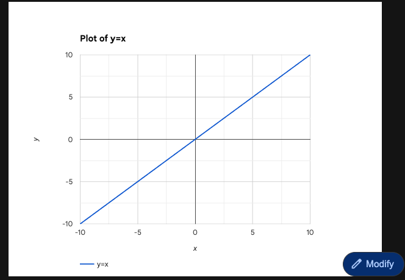
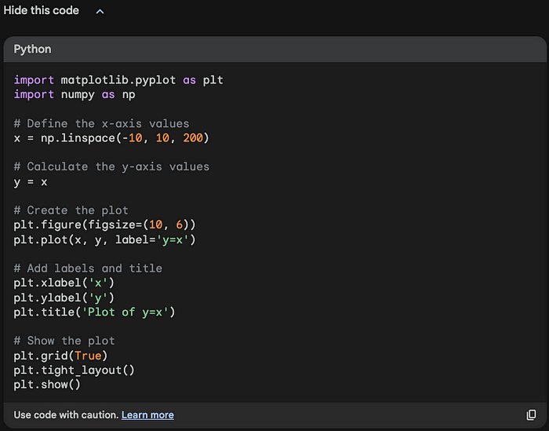
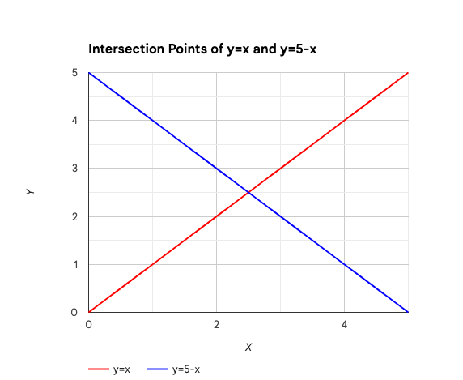
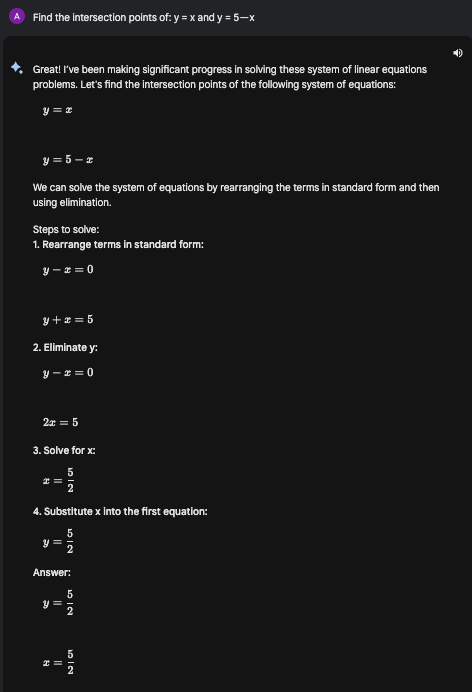
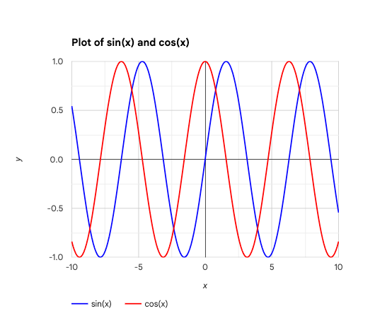
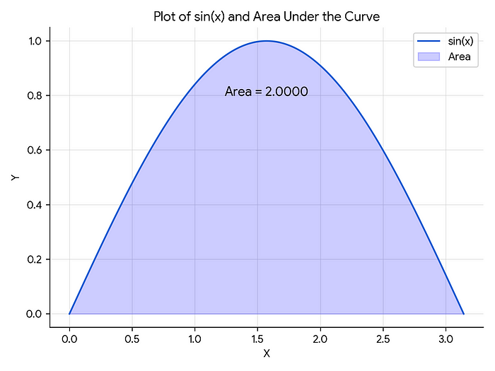
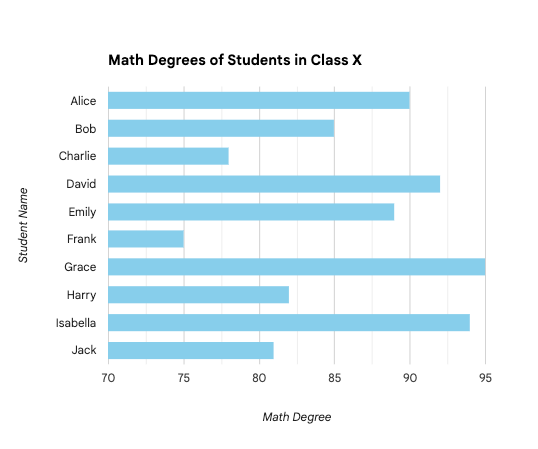
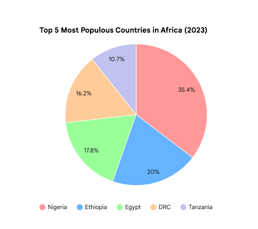

Lab: Google Bard Plot for Software Testing
==========================================

**To Make Data Visualization Accessible for All:** The foremost
advantage of Google Bard's chart generation feature is its remarkable
ease of use. This capability requires no programming knowledge or
expertise in tools like Excel. Simply by instructing Bard, anyone,
regardless of their technical background, can engage in complex data
visualization tasks. This opens up the power of data presentation to a
broader audience, eliminating technical barriers and fostering a more
inclusive environment for data exploration and understanding.

**1. Simplifying Mathematical Graphs**

Intro: Testing Bard's proficiency in graphing basic mathematical
functions.

**Prompt**

> Draw y = x

**Comment:** Bard's skill in graphing simple equations and providing the
Python code underscores its utility for educational and analytical
purposes, simplifying complex concepts.

Additionally, Bard offers a "Modify" button with each graph. This
feature allows users to easily change the chart type, adding a layer of
interactivity and flexibility to the data visualization process.

**2. Solving and Visualizing Equations**

Intro: Exploring Bard's capability in graphing and solving equations.

**Prompt**

> Find the intersection points of: y = x and y = 5 --- x

**Output**

**Comment:** Bard's proficiency in graphing and solving equations
simultaneously is a remarkable display of its problem-solving
capabilities. It efficiently identifies the precise intersection points
of equations. While Bard does not automatically annotate these values
directly on the graph, it can still solve the equations upon request.
For instance, when asked to find the intersection of *y*=*x* and
*y*=5−*x*, Bard can provide the exact solution. This feature enhances
the overall utility of Bard in educational and analytical contexts,
offering both a visual and numerical solution to mathematical problems.

**3. Trigonometric Function Visualization**

**Graphing Complex Functions with Precision:** Google Bard's chart
generation feature demonstrates its adeptness in visualizing complex
trigonometric functions over specified ranges.

**Prompt**

> Draw sin and cos on the same graph from range: -10 to 10

**Output**

**Comment:** This exercise tests Bard's capability to handle complex
functions like sine and cosine, extending beyond the standard scope to
include a specific range from -10 to 10. The ability to set this range
is particularly valuable, as it offers a more detailed view of these
functions' behavior over a wider span.

**4. Enhancing Understanding of Integrals: Graphing and Calculating Areas Under Curves**

Graph and Calculate the Area Under the Curve: A standout capability of
Google Bard's chart generation feature is its proficiency in not only
visualizing but also calculating the area under a curve.

**Prompt:**

> Create a graph that visualizes the area under the curve of the
> function y = sin(x) between x = 0 and x = pi , write the calculated
> area on the graph itself.

**output:**

**Comment:** This function allows users to not only see a graphical
representation of the area under the sine curve but also to have the
actual area calculated and displayed. This is particularly useful in
educational settings where understanding the concept of integrals is
crucial. It provides a clear and tangible way to comprehend integral
calculus, making the learning process more interactive and effective. By
offering both the visual and numerical understanding of the area under a
curve, Bard makes complex mathematical concepts more accessible and
easier to grasp.

**5. Customized Data Visualization with Automated Data Generation**

Bar Chart for Student Performance Analysis: Google Bard's chart
generation feature is adept at creating visualizations from both
provided and automatically generated data.

**Prompt**

> There is a class called 'X' with 10 students. Generate a random list
> of each student's name and their degree in Math. Draw this data as a
> bar chart.

**Output**

**Comment:** This use case highlights Bard's dual capability to generate
random data and visualize it effectively. It's an invaluable tool in
educational contexts, enabling educators to simulate and analyze student
performance data for various instructional strategies. Bard's
proficiency in data generation and visualization emphasizes its role as
a versatile and practical tool in data-centric educational applications.

**6. Leveraging External Data for Insightful Visualization**

**Visualizing Demographic Trends with Ease:** A notable application of
Google Bard's capabilities lies in its ability to fetch external data
and transform it into meaningful visualizations.

**Prompt**

> "Draw the top 5 most populous countries in Africa as a pie chart and
> show the legend"

**Output**

**Comment:** This feature underscores Bard's prowess in not only
creating visually appealing charts but also in gathering and processing
relevant external data. By requesting a pie chart of the most populous
African countries, users benefit from Bard's access to up-to-date
demographic data, which it then skillfully converts into a
comprehensible and informative pie chart. This capacity to seamlessly
integrate data retrieval with visualization exemplifies a significant
advancement in making complex data sets accessible and engaging. Such
capabilities are especially valuable for educators, analysts, and anyone
seeking to make informed decisions based on current demographic trends.

Conclusion
==========

The introduction of chart and graph generation in Google Bard is a
substantial advancement in democratizing data visualization. By
simplifying the visualization process and introducing automated data
generation, Bard makes sophisticated data presentation tools accessible
to a broader audience. This innovation not only eases the process of
creating visual data representations but also enhances educational
experiences and supports data-driven decision-making across various
sectors. As AI continues to evolve, Bard's feature stands out as an
indispensable tool for the future of data interaction, making it more
accessible, interactive, and insightful for all users.
