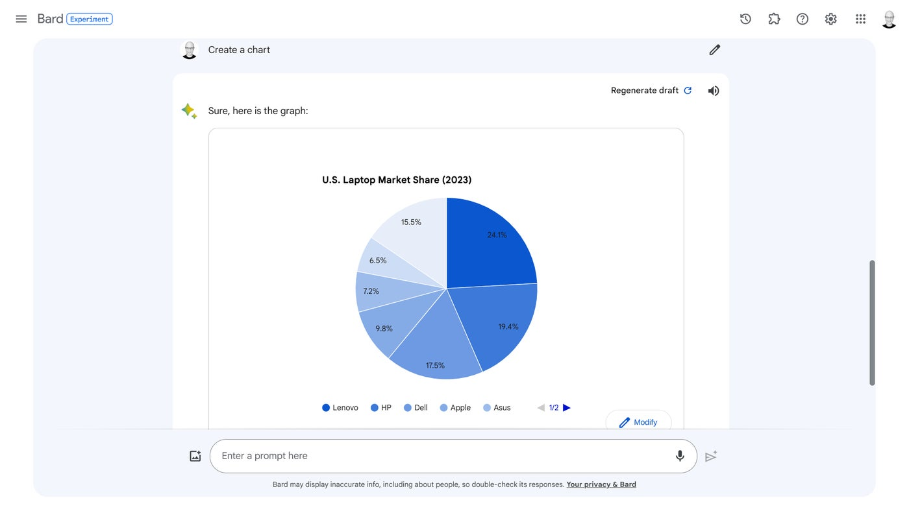
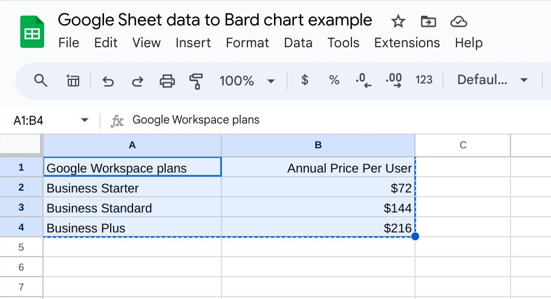
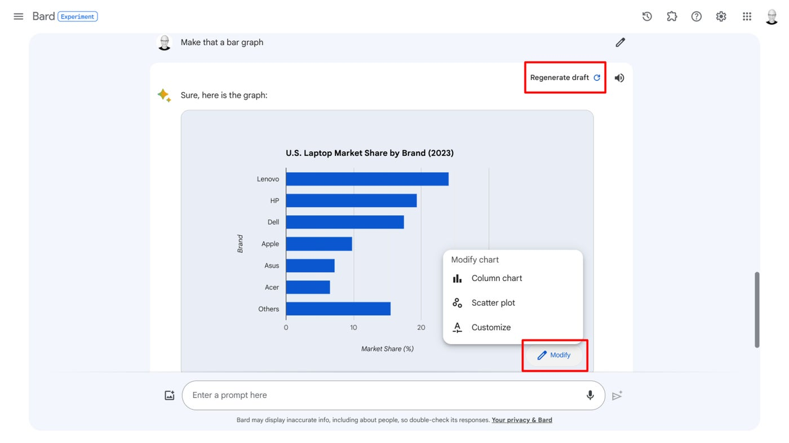

How to Create Charts with Google Bard
=====================================

Google Bard can turn data from a table into a chart, which is one
example of using the power of AI for simple data visualization.

To get started, sign in to [Bard](https://bard.google.com/) with your
personal Google account, then experiment with variations on the
sequences below. Make sure to follow any guidelines and policies that
apply when you use any AI tool in an organizational setting.

Option 1: Prompt Bard for a table, then a chart
-----------------------------------------------

Most often, you’ll want to go through a two-phase process to make a chart with Bard: Create a table and then create a chart.

In your initial prompt, detail the data you seek and make sure to
specify you want the information in a table. For example, try a prompt
such as:

`What are the largest 7 laptop makers in the U.S. by market share?`

Sometimes this might return a numbered list of the manufacturers
(**Figure A**). If it doesn't include a table, you might follow up with:

`Put that information in a table.`

**Figure A**

This sequence returns a list of seven laptop maker company names in one
column, with market share in a different column. Now, prompt Bard to:

`Create a chart.`

In this case, Bard generates a pie chart and a title for the chart
(**Figure B**). You may also ask for a specific type of chart, such as a
bar chart or line graph.

**Figure B**

Option 2: Prompt Bard with data for a chart
--------------------------------------------

Bard can create a chart with data you provide. For example, suppose you
have a set of cells in a Google Sheet that contain your data (**Figure
C**). Select the cells within the Sheet that contain the labels and data
for your chart, as you typically would for any type of copy operation.

**Figure C**

Next, start a prompt with something such as "Create a chart from this
data:" and paste the copied Sheets cell contents into the prompt
(**Figure D**).

**Figure D**

Edit the entry to ensure the data labels and values are appropriately
separated by spaces and commas, then submit the prompt. Bard should
generate a chart and a chart title from the data you provided (**Figure
E**).

**Figure E**

How to regenerate or modify a Bard chart
----------------------------------------

If you're not satisfied with the chart Bard builds, you have two
options: Regenerate Draft or Modify.

Select the Regenerate Draft option in the upper-right region of the
response area, and Bard will take another attempt to generate a response
to your prompt. Sometimes this produces the same chart as the initial
response; other times, it displays the data in a different type of
chart, such as a bar graph instead of a pie chart.

**Figure F**

Select the Modify button in the lower-right region of the response area
to access alternatives, which may vary based on your table and the
current chart. For example, in one pie chart Bard created, the Modify
menu lets you choose from two other chart types, Column Chart or Scatter
Plot, or a Customize option; sometimes, Bar Chart and Line Chart options
also may appear.

How to save and share a Bard chart
-----------------------------------

Take a screenshot of your Bard-created chart, save it and then share
that image as you might any other image. The Share options won't yet let
you share a chart, so a screenshot is the best way to capture and convey
chart content.
