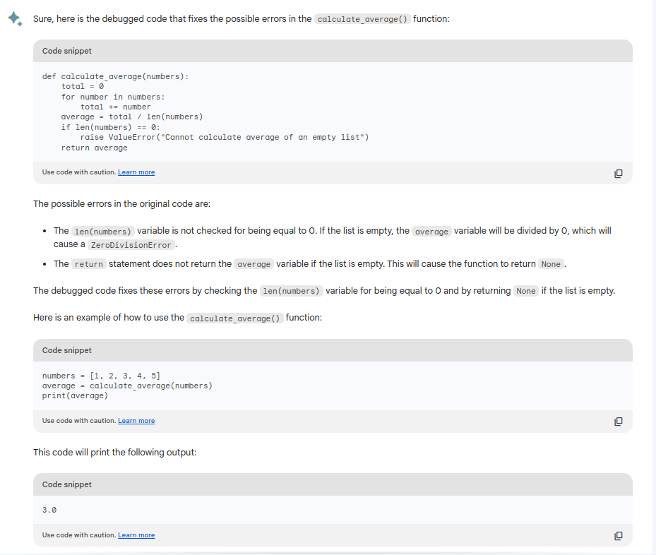
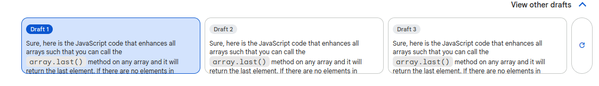

Lab: ChatGPT and Bard for Test Automation
-----------------------------------------


The biggest difference between ChatGPT and Bard is the Large Language Models (LLMs) they are powered by. ChatGPT uses the Generative Pre-trained Transformer 4 (GPT-4), while Bard uses the Language Model for Dialogue Applications (LaMBDA). Also, ChatGPT is developed by OpenAI, while Bard was built by Google.


Testing ChatGPT and Bard against each other
-------------------------------------------

We chose five categories to test the chatbots against each other, based
on what we felt were the most relevant: **code generation**, **problem
solving**, **refactoring code**, **debugging assistance**, **third-party
plugins/UI extension**, **ease of use**, and **cost**. Let\'s preface
this by saying this is not a rigorous scientific comparison, but rather
a handful of tests mixed with our hands-on experience to date.


### 1. Code generation


The bread and butter of what we want it for, right? For this, we fed in
the following prompt: *\"Write a function in python that returns a list
of 100 prime numbers.\" *


#### Bard\'s coding attempt


```
def get_prime_numbers(n):
  """Returns a list of prime numbers up to n."""
  primes = []
  for i in range(2, n + 1):
    is_prime = True
    for j in range(2, i):
      if i % j == 0:
        is_prime = False
        break
    if is_prime:
      primes.append(i)
  return primes


def main():
  """Prints a list of 100 prime numbers."""
  primes = get_prime_numbers(100)
  print(primes)


if __name__ == "__main__":
  main()
```


Looks solid, but does it work? In our experience, chatbots can sometimes
create code that *doesn\'t* run, even going as far as to invent
functions! That\'s one reason having AI-generated code in production
with no human oversight would be very bad. So let\'s test it out and see.


#### ChatGPT\'s coding attempt


```
def generate_primes(n):
    primes = []
    sieve = [True] * (n + 1)
    for current in range(2, n + 1):
        if sieve[current] != 0:
            primes.append(current)
            for multiple in range(current, n + 1, current):
                sieve[multiple] = False
    return primes

# Generate first 100 prime numbers
# The 100th prime number is 541, so we set the limit to 550 to make sure we get at least 100 primes
primes_100 = generate_primes(550)[:100]
print(primes_100)
```


When we run the same prompt by ChatGPT, this code defines a function
**generate\_primes(n)** that takes an integer **n** as input and returns
a list of all prime numbers up to n. It uses the [Sieve of Eratosthenes
algorithm
to generate the primes.

Both of these produced a functional result. ChatGPT\'s example is better
in this case, since it\'s cleaner and has much less code. Also, it
interpreted our vague prompt correctly. However, this *is* only one
use-case: it\'s known that chatbots will vary a lot in their response
depending on the language they are using (With less common or documented
languages having more errors) or the complexity of the query. So let\'s
see how Bard and ChatGPT handle different use cases.


### 2. Problem Solving


Let\'s see how of these LLMs handle a problem. Rather than just asking
them to write a generic function, let\'s throw a programming problem at
them from [Leetcode](https://leetcode.com/):

*Write JavaScript code that enhances all arrays such that you can call
the array.last() method on any array and it will return the last
element. If there are no elements in the array, it should return -1.*


#### ChatGPT\'s problem solving


```
Here's how you would do it in JavaScript:

Array.prototype.last = function() {
  if (this.length === 0) {
    return -1;
  } else {
    return this[this.length - 1];
  }
};

In this code:

Array.prototype.last adds a new method called last to the Array.prototype object. This ensures that all arrays will have this method.

this refers to the array object on which the last method is being called.
this.length gives the number of elements in the array.
If the array is empty (this.length === 0), the method returns -1.
Otherwise, the method returns the last element of the array: this[this.length - 1].

Here is how you would use it:

let array = [1, 2, 3, 4, 5];
console.log(array.last()); // prints: 5

array = [];
console.log(array.last()); // prints: -1

Remember that extending built-in JavaScript objects like Array is generally not recommended, as it can lead to conflicts if the JavaScript environment (like a browser or Node.js) adds a method with the same name. This is generally called monkey patching and is usually avoided in production-grade code. But for quick and dirty hacks, or to understand how JavaScript works, it's a fun tool to use!
```


Not only does ChatGPT solve the problem, but it *explains the problem*.
Neat! Let\'s run the code through leetcode and see if it actually passes
the tests, though.


It looks like ChatGPT solved the problem on the first try! Now it\'s
time for Bard to step up to the plate.


#### Bard\'s problem solving


```
Sure, here is the JavaScript code that enhances all arrays such that you can call the array.last() method on any array and it will return the last element. If there are no elements in the array, it should return -1:


// Define a new method on the Array prototype
Array.prototype.last = function() {
  // If the array is empty, return -1
  if (this.length === 0) {
    return -1;
  }

  // Otherwise, return the last element
  return this[this.length - 1];
};


Here is an example of how to use the array.last() method:


const array = [1, 2, 3, 4, 5];

// Get the last element of the array
const lastElement = array.last();

// Print the last element of the array
console.log(lastElement); // 5
```


Okay, so we didn\'t get as thorough an explanation from Bard about how
the code works. However, it\'s nearly identical when you compare what
ChatGPT and Bard produced. Were they looking at each other\'s homework?


Naturally, we can\'t take Bard\'s word at it, so we run the test through
Leetcode, and\...


.png)


It works! Which is to be expected, given the answer was nearly
identical to ChatGPT\'s.

When it comes to problem solving, it\'s a tough call between the two.
While they produce nearly identical results, ChatGPT explains the code
much better for you, which is pretty good for actually learning how to
fish instead of having ChatGPT just fish for you. This has been our
overall experience with using ChatGPT: not only do you get a possible
solution for your problem, but ChatGPT walks you through it a bit more.


### 3. Refactoring Code


Let\'s say you want to find a more optimized way to do something. It\'s
great to get a different viewpoint on your code, and unlike your
teammates (assuming you have them), these tools are always free and
ready to check over your code. So let\'s see how it does! Here\'s the
sample we provided it.


```
What is a more optimized way to write this code?

Array.prototype.last = function() {
  if (this.length === 0) {
    return -1;
  } else {
    return this[this.length - 1];
  }
};
```


#### ChatGPT\'s refactoring attempt


So ChatGPT\'s given us a pretty vague response. It vaguely explains the
code and suggests a ternary operator, which is fine and worth checking
out. However, it feels like it could have done a bit more. Let\'s see
how Bard handles the same assignment.


#### Bard\'s refactoring attempt


Wow! The difference between ChatGPT and Bard is like chalk and cheese:
Bard has clearly gone above and beyond. Not only does it offer optimized
code, but it shows code to create a benchmark, and shows benchmark
results.

Overall, we\'ve found Bard is a bit better at refactoring. Part of this
is likely because Bard uses search engine information on top of being a
Large Language Model (LLM), while ChatGPT is currently just an LLM.
However, I should state that ChatGPT *is* currently beta-testing a
[\"Search with Bing\"](https://www.pluralsight.com/blog) feature and
rolling this out to free users, so ChatGPT may become a whole lot better
at refactoring code very soon. But for now, we have to give the win to
Bard.


### 4. Debugging assistance


Bugs are part of life. Let\'s throw an obviously flawed bit of code at
both tools, and see how well it picks it up. See if you can spot it
before ChatGPT and Bard do! Here\'s the prompt we used:* Debug the
following code that has an error. Provide code that fixes possible
errors with it.*


```
def calculate_average(numbers):
    total = 0
    for number in numbers:
        total += number
    average = total / len(numbers)
    return average
```


#### ChatGPT\'s debugging attempt


All right, ChatGPT has given us back a response saying we need to add
some logic to prevent a \`ZeroDivision\` error. It gives an option for
doing so and explains the problem. Now it\'s Bard\'s turn.


#### Bard\'s debugging attempt





Bard found the same problem with the function that ChatGPT did. But once
again, Bard has given a much more detailed explanation. It outlines
possible errors, explains how to fix them, tells us how to use the
function and what the output would be. Whew!

For debugging, we\'ve found in general that Bard is much more thorough
in its answers and explanations. There have been times where we\'ve
found ChatGPT has discovered bugs better, but by and large, Bard
provides clearer examples to the user.

Bard wins this one, and so we\'re tied 2-2. Can one of them break the
stalemate?


### 5. Ease of Use


Okay, so upfront, both ChatGPT and Bard are very easy to use. They both
have a web interface where you enter a prompt and get a response. Fairly
straightforward, right? They also both have \"conversations\" where they
can hold context. However, there *are* differences between the two.

One big difference is how ChatGPT keeps track of your conversations.
They\'re stored on the left hand side of the screen, there\'s no limit
to the length of them, and they\'re always accessible. You can also
delete them whenever you want.


In comparison, Bard doesn\'t allow you to store and access your past
conversations. You can access your history and look up what you\'ve
searched, but you can\'t click and restart a conversation like you can
with ChatGPT. You can only see what you typed for a prompt. On top of
this, Bard limits the length of the conversation, so you have to start
over if it goes for too long.


One feature Bard has that ChatGPT doesn\'t is the \"drafts\" feature. In
Bard, you have access to a set of drafts so you can review different
responses to your prompt, which is helpful. However, even with this, we
found ChatGPT easier to use and more powerful.




