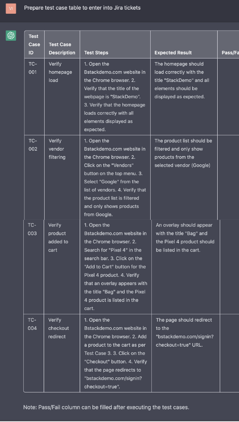
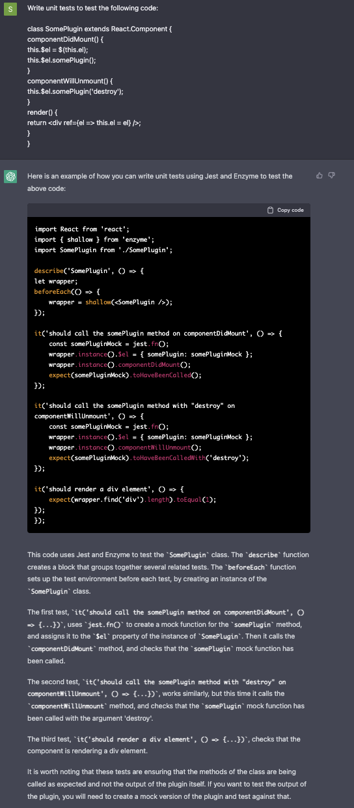
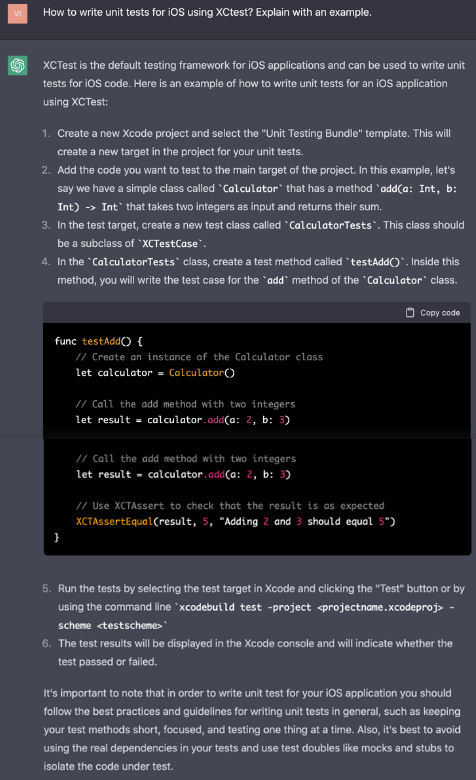
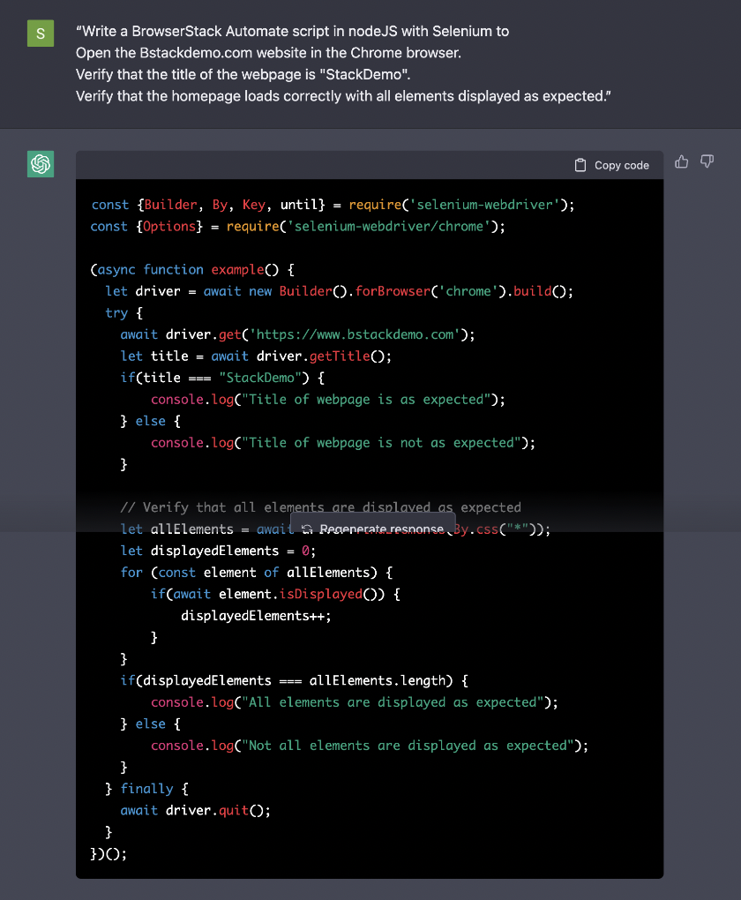
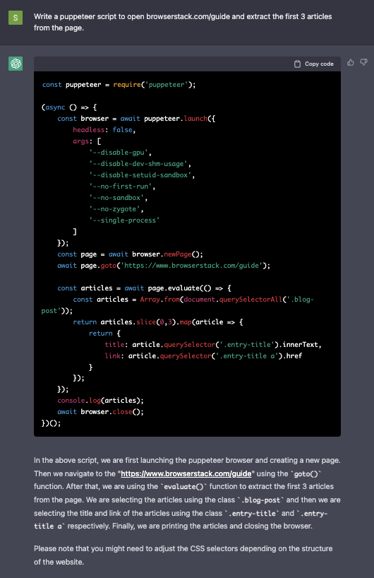
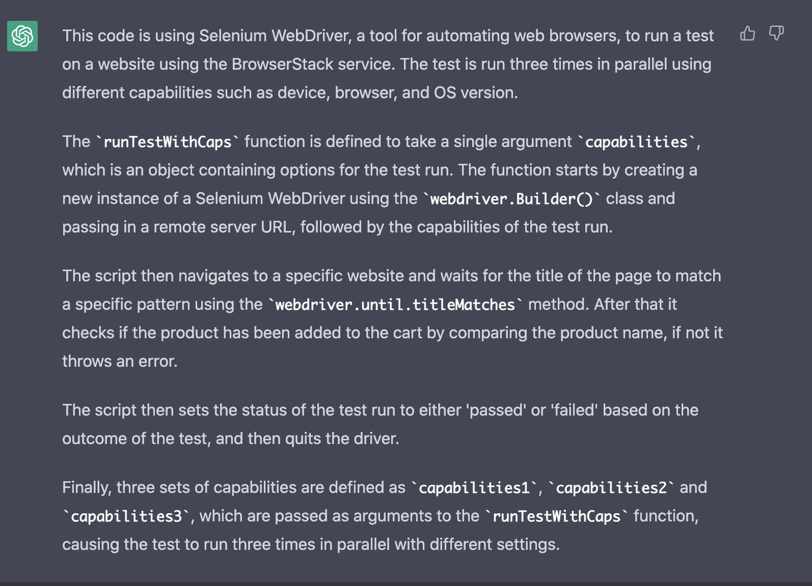
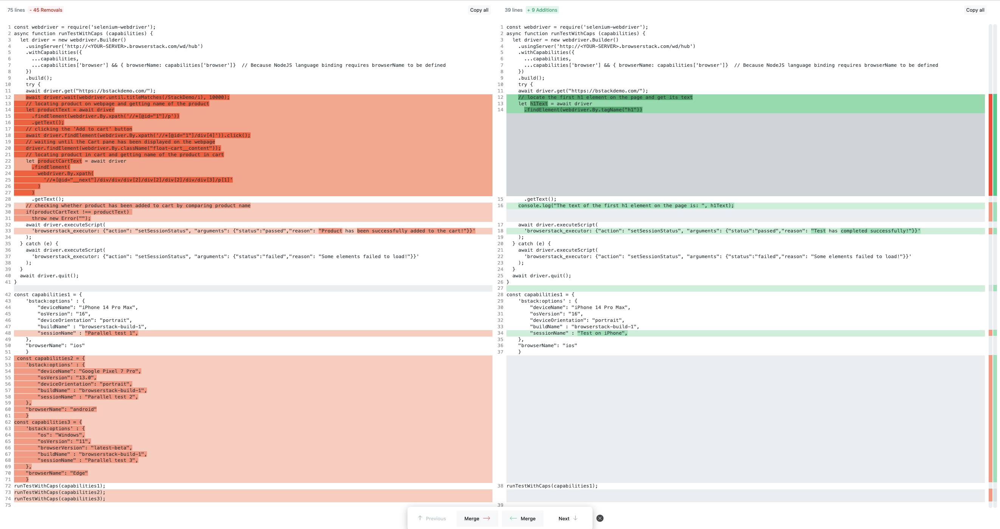
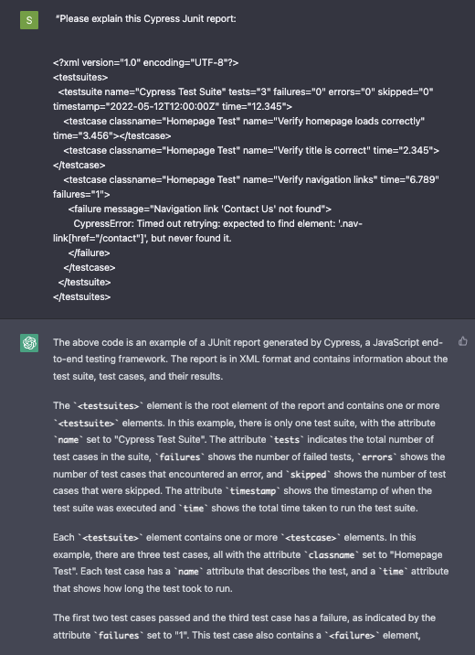
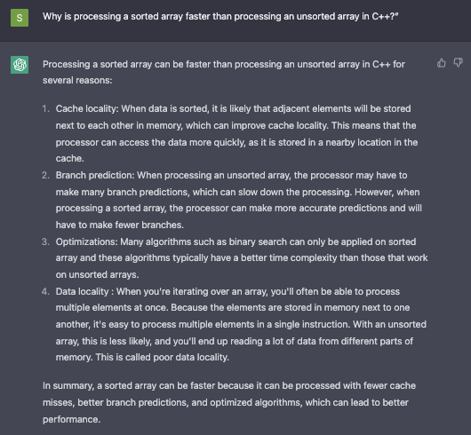

### Using ChatGPT for Automation Testing

Test automation is essential for bug-free software and ensuring desired user experience. As technology advances, so does the complexity of test automation. 

Keeping up with the latest tools and techniques can be a daunting task, especially for those who are not familiar with coding or are new to the field. 

#### **Test planning with ChatGPT**


**Exercise 1:** Suppose you had a website bstackdemo.com on which you
have built some functionality, and you want to plan the test
automation.

You can use GPT in such cases by giving it the details on functional
components and their use and asking it to generate a test
plan.

**Prompt**: "Bstackdemo.com is an eCommerce website. Prepare a test
plan for automation tests to carry out the following validations on the
website:

- Open browserstack.com. Success if page loads with title ‘StackDemo’
- Under vendors, select ‘Google’. Success if product list is filtered.
- Add pixel 4 to cart. Success if overlay with title ‘Bag’ shows entry.
- Click on checkout. Success if page redirects to ‘/signin?checkout=true’”


**ChatGPT**:


And just like that, you have enough template material to start a test
document. You can share this with your team and start building on this
basic plan.

Notice not only did It understand the task from limited information,
but it also figured out an appropriate platform and automation tool to
test with. Once your plan is ready you can test it on
BrowserStack.

**Exercise 2:** You can use ChatGPT to reformat and prepare any data for
any other format.

Let’s say you want the test plan in a format where it could be easy for you to enter it into a Bug tracking platform like Jira or Github. 

You could use ChatGPT in such case by prompting further in the same thread :

**Prompt**: "Prepare test case table to enter into Jira tickets"

**ChatGPT**:




#### **Unit testing with ChatGPT**

**Exercise 1:** You can give ChatGPT a piece of code and it will write
unit tests for it in the desired format.

**Prompt**: "Write unit tests to test the following code:


```
class SomePlugin extends React.Component {
componentDidMount() {
this.$el = $(this.el);
this.$el.somePlugin();
}
componentWillUnmount() {
this.$el.somePlugin('destroy');
}
render() {
return <div ref={el => this.el = el} />;
}
}
```


**ChatGPT**:





Not only can it recognize the language of input code without any information from our side, but it also uses a correct library called Enzyme, and goes on to explain the exercises in further depth with appropriate disclaimers.


**Exercise 2**: If you are a beginner and just want to learn concepts,
you can ask ChatGPT to give exercises and explain how unit testing works
in any popular language or framework.

**Prompt**: "How to write unit tests for iOS using XCtest? Explain with
an exercise."

**ChatGPT**: Responds with definitions, exercises, and a detailed
explanation:




The power to seamlessly present concepts, code samples, and
explanations for code is what makes ChatGPT a powerful tool to be
deployed in various coding scenarios including test
automation.

#### **Write test automation in any framework with ChatGPT**

**Exercise 1**: Web testing with [Selenium](https://www.selenium.dev/)

Continuing with the test plans generated earlier, you can use ChatGPT
to now write test automation code for the
same.

**Prompt**: "Write a BrowserStack Automate script in nodeJS with
Selenium to

1. Open the Bstackdemo.com website in the Chrome browser. 
2. Verify that the title of the webpage is “StackDemo”. 
3. Verify that the homepage loads correctly with all elements displayed as expected.”


**ChatGPT**:



**Exercise 2**: Mobile testing with [Appium](https://appium.io/)

**Prompt**: "How to write automation test in BrowserStack using Appium?
Explain with a short exercise."

**ChatGPT**:

**


**Exercise 3**: Web crawl using [Puppeteer](https://github.com/puppeteer/puppeteer)

**Prompt**: "Write a puppeteer script to open browserstack.com/guide
and extract the first 3 articles from the
page."

**ChatGPT**:




Just like this, by varying the prompts appropriately, you can generate
code samples for the programming language and automation framework of
your choice.

These code snippets are never 100% on syntax, but enough for you to
have a coarse structure that can be further worked upon and refined with
the help of official guides and, again,
ChatGPT.

#### **Advanced Script level operations with ChatGPT**

**Exercise 1:** You can use the AI to explain to you a part of the code
or the entire file; you can just copy and paste and ask it to explain it
back by:

**Prompt**: Explain the following code:


```
const webdriver = require('selenium-webdriver');
async function runTestWithCaps (capabilities) {
let driver = new webdriver.Builder()
.usingServer('http://<YOUR-SERVER>.browserstack.com/wd/hub')
.withCapabilities({
...capabilities,
...capabilities['browser'] && { browserName: capabilities['browser']} // Because NodeJS language binding requires browserName to be defined
})
.build();
try {
await driver.get("https://bstackdemo.com/");
await driver.wait(webdriver.until.titleMatches(/StackDemo/i), 10000);
// locating product on webpage and getting name of the product
let productText = await driver
.findElement(webdriver.By.xpath('//*[@id="1"]/p'))
.getText();
// clicking the 'Add to cart' button
await driver.findElement(webdriver.By.xpath('//*[@id="1"]/div[4]')).click();
// waiting until the Cart pane has been displayed on the webpage
driver.findElement(webdriver.By.className("float-cart__content"));
// locating product in cart and getting name of the product in cart
let productCartText = await driver
.findElement(
webdriver.By.xpath(
'//*[@id="__next"]/div/div/div[2]/div[2]/div[2]/div/div[3]/p[1]'
)
)
.getText();
// checking whether product has been added to cart by comparing product name
if(productCartText !== productText)
throw new Error("");
await driver.executeScript(
'browserstack_executor: {"action": "setSessionStatus", "arguments": {"status":"passed","reason": "Product has been successfully added to the cart!"}}'
);
} catch (e) {
await driver.executeScript(
'browserstack_executor: {"action": "setSessionStatus", "arguments": {"status":"failed","reason": "Some elements failed to load!"}}'
);
}
await driver.quit();
}
const capabilities1 = {
'bstack:options' : {
"deviceName": "iPhone 14 Pro Max",
"osVersion": "16",
"deviceOrientation": "portrait",
"buildName" : "browserstack-build-1",
"sessionName" : "Parallel test 1",
},
"browserName": "ios"
}
const capabilities2 = {
'bstack:options' : {
"deviceName": "Google Pixel 7 Pro",
"osVersion": "13.0",
"deviceOrientation": "portrait",
"buildName" : "browserstack-build-1",
"sessionName" : "Parallel test 2",
},
"browserName": "android"
}
const capabilities3 = {
'bstack:options' : {
"os": "Windows",
"osVersion": "11",
"browserVersion": "latest-beta",
"buildName" : "browserstack-build-1",
"sessionName" : "Parallel test 3",
},
"browserName": "Edge"
}
runTestWithCaps(capabilities1);
runTestWithCaps(capabilities2);
runTestWithCaps(capabilities3);
```


**ChatGPT**:



Pretty good summary by ChatGPT.

**Exercise 2**: Now, if you want to change something in the code -- like
instead of running 3 tests, just run on one device and change test
parameters, etc. You can make ChatGPT do that by prompting something
like this:

**Prompt**: "Change the provided exercise code, and instead of running 3
tests in parallel, run only the first one on the iPhone and remove
others. After that, change the part where it matches the title of the
page and product name and remove it. In its place, after opening
bstackdemo.com, just check and log the first h1 element on the
page."

**ChatGPT**:


It seamlessly understands sandwiched commands and outputs this code,
which when we ran through diff checker against the original code we get
this:



This is not far from what a human developer's git revision before code
push would look like. 

As you can see, it can maintain this flow of back and forth
irrespective of how long the conversation is and make the right changes
in the right place.

Ideally, you should start with small bits and try to put them together
to get the most out of its capabilities. Feeding it large prompts could
lead to difficulties while trying to control it and also a bad
server-side response time.

#### **Data analysis and summarisation**

ChatGPT can be used by developers and QA professionals to improve their
routine reporting and data analysis activities in several ways,
especially related to testing automation report
analysis.

ChatGPT can be used to summarize the test execution results, providing
an overview of the test results, including the number of tests passed,
failed, and skipped.

**Exercise 1**: Understand XML report from [Cypress](https://www.cypress.io/) Junit

**Prompt**: "Please explain this Cypress Junit report:


```
<?xml version="1.0" encoding="UTF-8"?>
<testsuites>
<testsuite name="Cypress Test Suite" tests="3" failures="0" errors="0" skipped="0" timestamp="2022-05-12T12:00:00Z" time="12.345">
<testcase classname="Homepage Test" name="Verify homepage loads correctly" time="3.456"></testcase>
<testcase classname="Homepage Test" name="Verify title is correct" time="2.345"></testcase>
<testcase classname="Homepage Test" name="Verify navigation links" time="6.789" failures="1">
<failure message="Navigation link 'Contact Us' not found">
CypressError: Timed out retrying: expected to find element: '.nav-link[href="/contact"]', but never found it.
</failure>
</testcase>
</testsuite>
</testsuites>
```


**ChatGPT**:



**Exercise 2**: Make sense of system/coding errors with
ChatGPT.

**Prompt**: “What could be the cause of this error in Xcode:

*** Terminating app due to uncaught exception ‘NSUnknownKeyException’, reason: ‘[<UIViewController 0x6e36ae0> setValue:forUndefinedKey:]: this class is not key value coding-compliant for the key XXX.’


ChatGPT:


**Exercise 3**: Sharpen programming language skills with
ChatGPT.

**Prompt**: "Why is processing a sorted array faster than processing an
unsorted array in C++?"

**ChatGPT**:



Now, for the last section of our series of exercises, let us look at the
most general and powerful capability of ChatGPT, which is to behave like
a real human with thoughts and opinions on various aspects of
development, automation testing or whatever else you want to discuss
with it.

**Exercise 1:**  ChatGPT for help with technical decisions.

**Prompt**: "We want to build a 5-page web app as a prototype for our
new product series catalog, we have about 15 days to do that before the
meeting and we have not decided what frameworks to use, please suggest
the best frameworks/libraries for TS, CSS, DB, build, CICD and
automation testing."

**ChatGPT**:


**Prompt**: "How do you foresee the Cloud test automation market
evolving in the next 5 years to come?"

**ChatGPT**:


