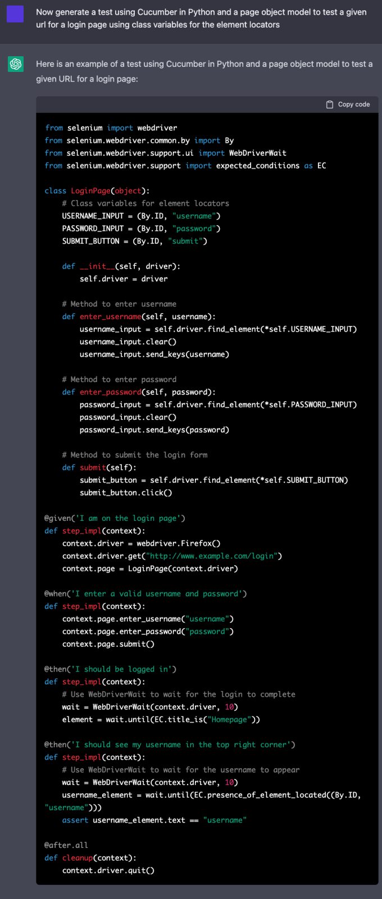

## Lab: ChatGPT for Automated Testing: From Conversation to Code

ChatGPT can be viewed as a powerful low-code tool for writing test
cases. ChatGPT accepts natural language as input, so users can write in
their natural cadence and still be understood, unlike template-based
models which often rely on particular language structures or key
phrases. As we will show, ChatGPT does a remarkable job of generating
test automation scripts, classes, and functions.

### A Language for Low-Code: Cucumber

While ChatGPT can generate many languages and libraries, its sweet spot
is its ability to generate [Cucumber](https://cucumber.io/) code.
Cucumber is a testing framework that uses behavior-driven development.
Scenarios are written in plain English, with some key terms like
"Given," "When," and "Then" in a feature file. Then, in step
definitions, these natural language phrases are associated with code.

Test maintenance is one of Cucumber's benefits since Cucumber scenarios
combine the natural language intent of a test with the automation code
which implements it. This lets testers who aren't as familiar with test
code understand the linkage between test intent (in natural language)
and test code. This leans into ChatGPT's strength of generating natural
language with associated source code.

### ChatGPT and Cucumber Test Case Example

Now let's see what ChatGPT can do.

As you can see in the following example, ChatGPT's ability to generate
code is quite impressive. With a simple prompt, it can generate the
scenario and the step definitions used by Cucumber all at once. It even
knows the different components Cucumber needs to run without being
explicitly told.

 

The prompt is vague about what to test on the website, but ChatGPT still
generates a script to test one of the main features of the Google
website, its search functionality. In this example, it even correctly
identifies the name of the search bar for Google, "q."

#### A General and Manageable Script

While this is a good example of ChatGPT's ability to write code in
general, not all websites are as ubiquitous as Google. Its accuracy in
predicting the identifier "q" does not indicate it will always be
correct. And, from testing ChatGPT, we know that if it doesn't know an
accurate element locator, it will make one up.

Going through the generated code and finding and replacing all element
locators is tedious, but the problem can be made much easier by
separating the code about the page itself from the test cases. We do
this by using a page object model. Using a page object model also allows
us to update the code if element locators or the structure of the app
changes between tests, improving the maintainability of the testing
script.

In the following example using Cucumber in Python, we generate a generic
test for a login page of a website and instruct ChatGPT to use a page
object model and class variables for the element locators.

ChatGPT correctly generated the aptly named LoginPage object which
represents the element locators as class variables and has methods for
the common functionalities on login pages, such as entering one's
username. The step definitions, at the bottom of the example, use the
methods in the LoginPage to interact with the website.

Now, using the page model object and the step definitions, it seems as
though a user could either automate (with ChatGPT) or manually write
scenarios to test the website and have working test code! But will it
actually work as-is?

#### Using ChatGPT to Change and Fix Code

If you look closely, you can see all the input values for the test, such
as the URL, username, and password, are all hard-coded into the step
implementation. It is unlikely that the website you are testing will be
"http://www.example.com/login" and that a working username and password
combination will be "username" and "password" respectively. And these
values do not need to be hard-coded; Cucumber can take variables from
the feature file in the scenarios.

But what if you don't know how this is formatted or don't want to spend
the time to update all the code? Well, you can ask ChatGPT to fix it for
you.

By requesting ChatGPT to update the previously generated code, we can
fix the problem. The updated step implementations read in the values
that we requested instead of hard coding the most likely incorrect
values. That is one of the remarkable features of ChatGPT: the
conversational nature of the model allows you to tell the system exactly
what you want to change in the code, and it is quite good at listening
to and executing your requests.

#### ChatGPT and Sauce Labs

ChatGPT can generate test scripts that are compatible with Sauce Labs.
Since running your script on Sauce Labs requires completely updating how
the test is launched
using Selenium,
having ChatGPT write an accurate startup method could be vital to a user
without much coding experience. By just adding "and run the test on
Sauce Labs" to the prompt we can generate a script that includes an
accurate method to start the test.

 
The third code block includes the code to start testing using Sauce
Labs. ChatGPT uses the correct URL, passes the necessary capabilities,
and uses the correct driver method to start the test. While it
arbitrarily decides which platform, browserName, and version to use,
these are easily updated either manually or by telling ChatGPT to update
these features.
