Lab: Using ChatGPT for Rest Endpoint Testing
--------------------------------------------

ChatGPT can be useful for software testing in several ways, such as test
case generation, test data generation, bug reporting, test management,
test automation etc. Here I aimed to explain how to use ChatGPT for the
implementation of the manual test cases and automated test scripts, for
REST endpoint testing.

Assume that there is an endpoint with URL
`https://\<your-api-host\>/booking`, and we want to perform some ordinary
booking transactions like "create a booking entry, get data of the
booking entry, update data of the booking entry, delete booking entry".
Again assume that we will do it manually, by sending each request one by
one, to the endpoint. At this point, we can ask ChatGPT how to construct
the requests, i.e. request bodies (payloads) and about the positive and
negative test cases. Let's see our conversation now...

Let's ask ChatGPT the following:

-   *I have the following endpoint with some conditions. Endpoint:
    /booking, Request Type: POST. This endpoint excepts a JSON body with
    the following attributes: firstname (max of 20 characters, no
    numbers), lastname (max of 20 characters, no numbers), totalprice
    (max of 5 digits), depositpaid (boolean value), bookingdates
    (includes checkin (a valid date) and checkout (a valid date) ) where
    checkin is always less than or equal to checkout, additionalneeds
    (max of 15 characters, no numbers). Please provide me with HTTP
    Request call for this REST endpoint. Then please provide me a list
    of manual test cases (positive and negative) to test this endpoint.*

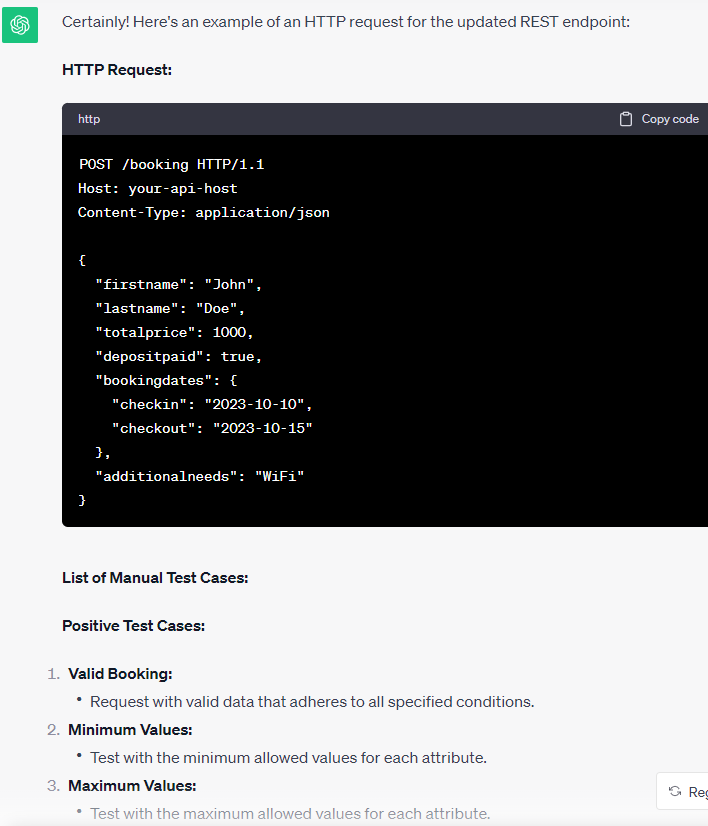

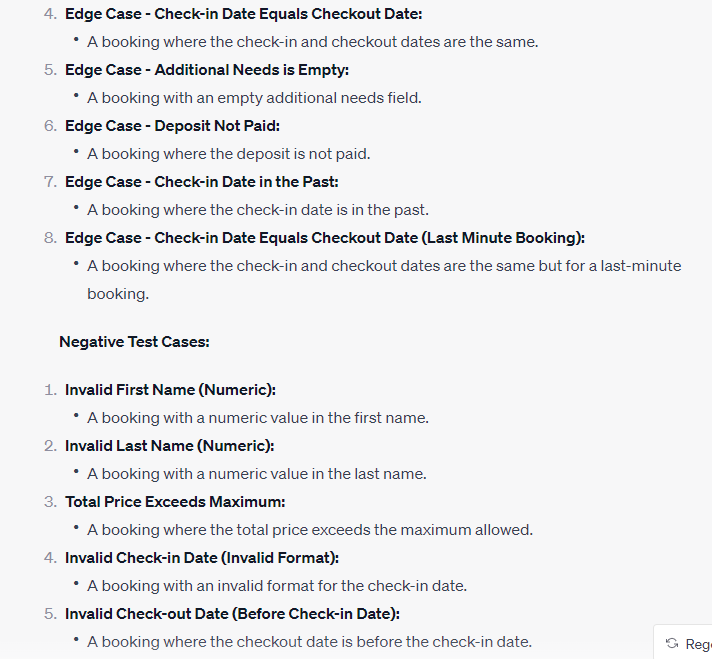

As you may have already seen, the answer from ChatGPT is easy to
understand and provides enough information about *create* operation and
about the list of the test cases, which gives a solid foundation to
start testing. At the end it provides recommendations and best practices
too.

In order to get information about other operations such as *read,
update* and *delete*, we continue to ask ChatGPT further. See below...

-   *For the same endpoint: /booking, please provide me with HTTP
    Request to get data of the booking entry created by the previous
    POST request. This time Request Type: GET.*

 

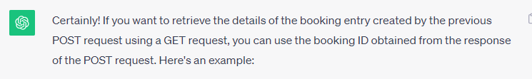

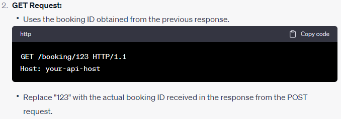

-   *For the same endpoint: /booking, please provide me with HTTP
    Request to update some of the fields of the booking entry created by
    the previous POST request. This time Request Type: PUT.*

 

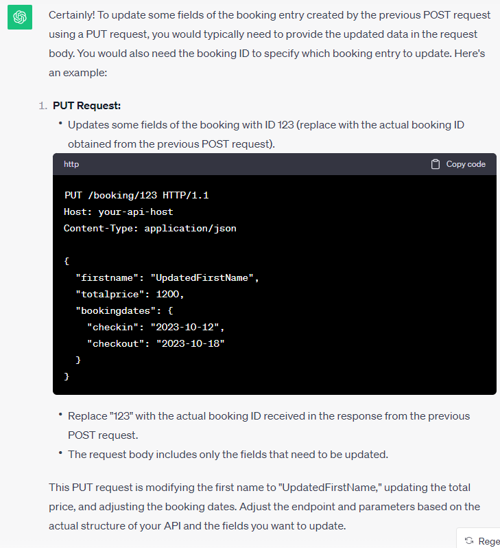

Please pay attention here. The method PUT obligates the existence of all
request parameters *(firstname, lastname, totalprice, depositpaid,
bookingdates (includes checkin and checkout), additionalneeds)* in the
request body. Therefore, in the answer given above, PATCH method is
allowed only. But ChatGPT has overlooked this error, due to some of its
limitations by nature, which are explained at the end of the text.

-   * For the same endpoint: /booking, please provide me with HTTP
    Request to delete the booking entry created by the previous POST
    request. This time Request Type: DELETE.*

 

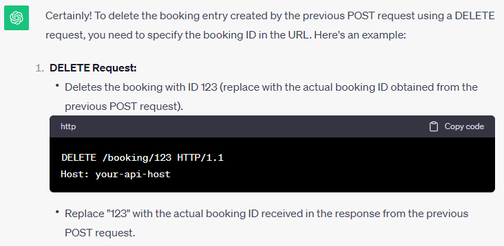

Instead of testing manually, you can prefer to run HTTP commands
automatically, by implementing a test script. You can ask ChatGPT for
the code you require...

-   * *Please provide me with java code to test these HTTP Request
    automatically, given for the endpoint: /booking** 

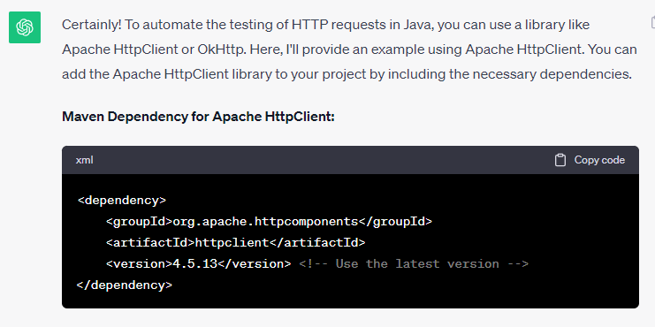

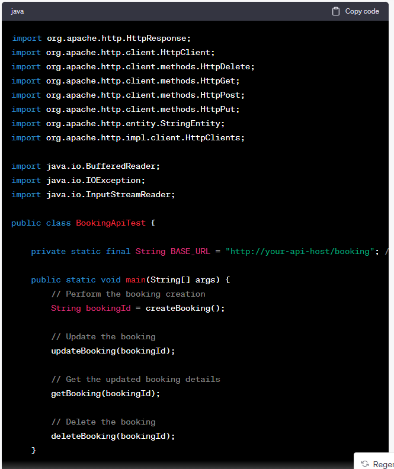

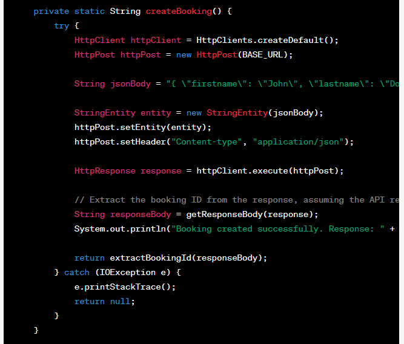

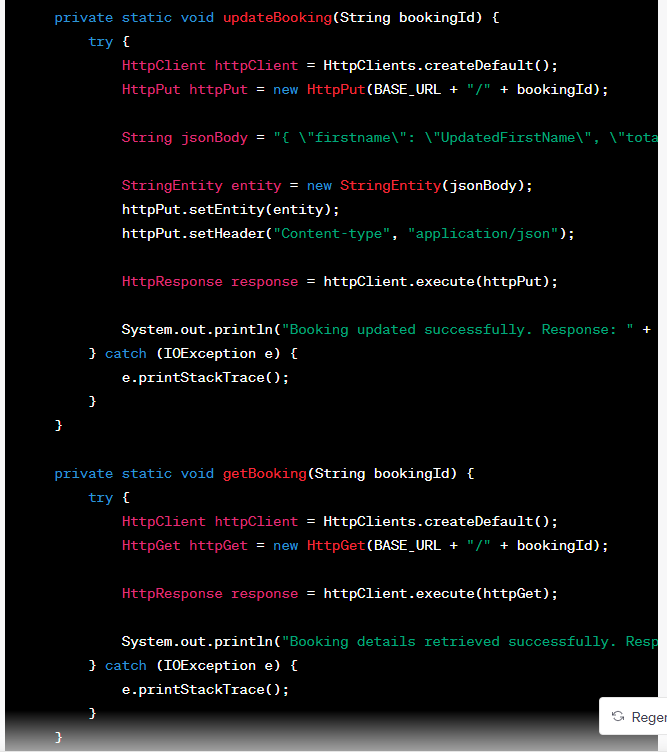

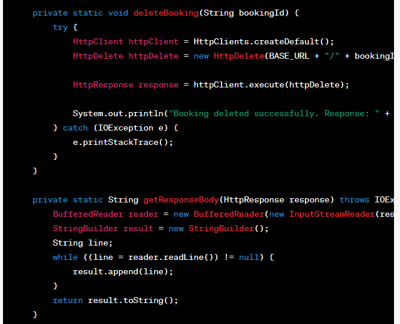

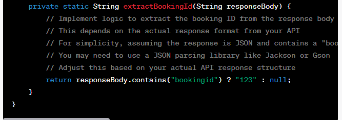

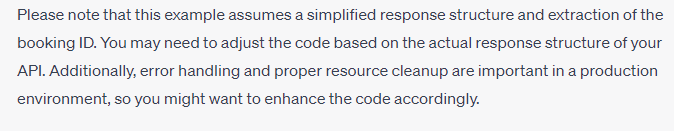

 

Again a clear and well-commented answer from ChatGPT. It also provides
the detailed explanation for the script and required packages to be
installed, which is allowing testers to quickly generate and customize
automated tests.

**Limitations of ChatGPT when using for testing **

While ChatGPT has a lot of potential to be a valuable support for
software testing, it still has some downsides.

ChatGPT relies on patterns it has learned from the text it has been
trained on and does not possess the actual meaning and domain knowledge
behind it. Therefore, it can sometimes provide contextually incorrect
responses.  Testers need to have a solid understanding of the coding
language being used, the application under test, packages being used
etc., in order to detect plausible-sounding, believable, but incorrect
answers from ChatGPT.

Furthermore, ChatGPT does not run the command / code itself and
therefore has no way to know if the command / code generated is
runnable. If ChatGPT attempts to offer a wrong method like PUT instead
of PATCH, or a deprecated method like "find\_element\_by\_\*" to locate
UI elements, tester must have the ability to recognize what the problem
is.

**Conclusion**

ChatGPT is a powerful AI tool with huge potential in software testing.
From test management to test automation, it can help simplify and speed
up testing process and ensure top quality assurance. However, it has
various limitations and cannot perform complicated tasks, which require
critical thinking and creativity of human testers. So it should be seen
as a tool that can improve the work of human testers.

 