Lab: ChatGPT for Test Automation
================================

ChatGPT for automation testing can be done in the following multiple scenarios, among numerous others:

### Writing Test Scripts with ChatGPT

ChatGPT can generate test scripts while independently assuming different scenarios for ChatGPT test automation. The complete operation of the same was evident when we entered the test query “create a test script with 2 assumed methods to open a school website and download the brochure”. ChatGPT assumed two methods, one to directly download the brochure through the available button while another to navigate through the site and reach the desired location to download it. 

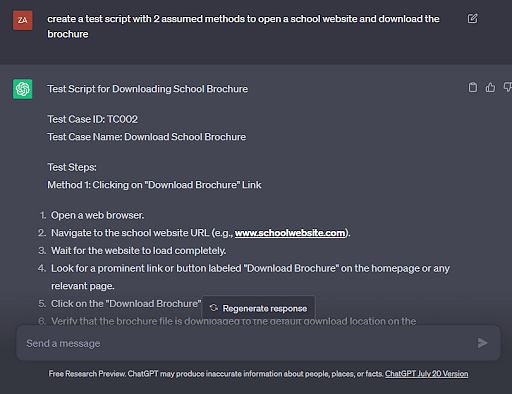

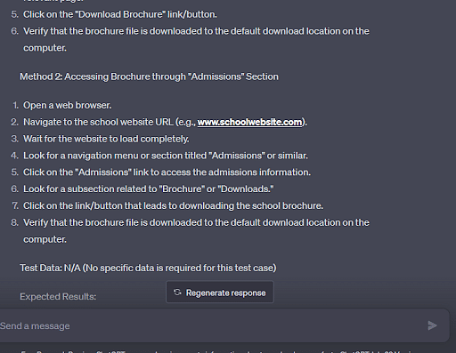

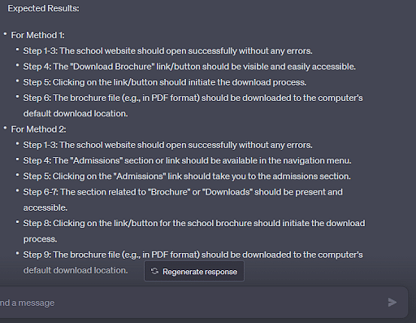

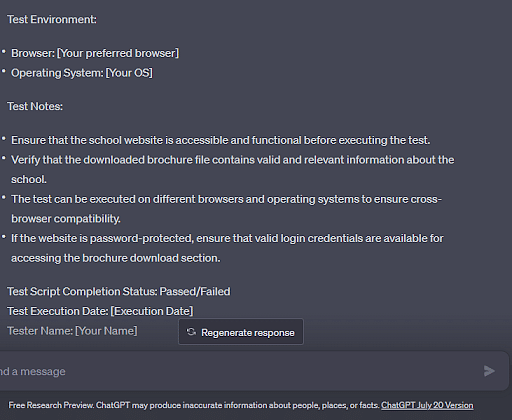

### Generating Test Data

ChatGPT test automation involves generating test data. Here we generated test data with the prompt “generate test data of 10 patients in a tabulated manner for researching the gut microbiome of patients with comorbid conditions like diabetes, CVD. Ensure considering all the relevant parameters”. ChatGPT generated the test data considering multiple directly associated parameters. Further, it also informed us about the random and unreal generation of data and the importance of taking real data. 

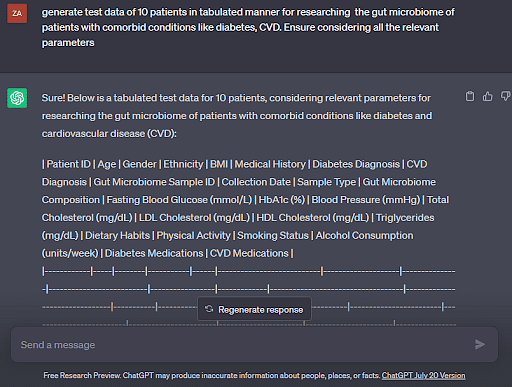

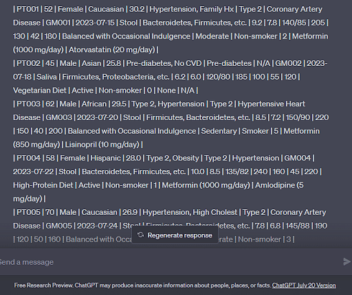

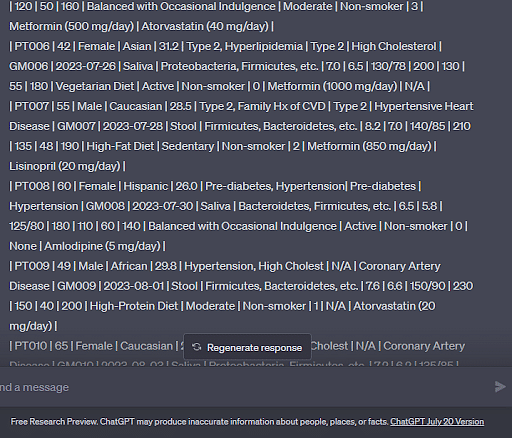

### Using ChatGPT to Change and Fix Code

Here we assume a simulation to indicate cytoskeleton (biologically
cellular structure) movement. This structure is responsible for the
movement of cells, such as immune cells that fight off infection in our
body. The prompt to fix the code was, "I have a Python function to
simulate the cytoskeleton movement. But the simulation seems to be
unable to portray actin and myosin filament accurately. How to fix the
code for this?" ChatGPT test automation fixed the error by introducing
random movement and time steps and improving the interaction between the
two. 

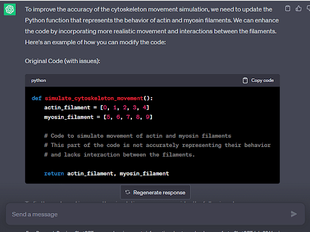

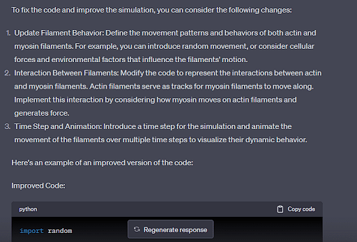

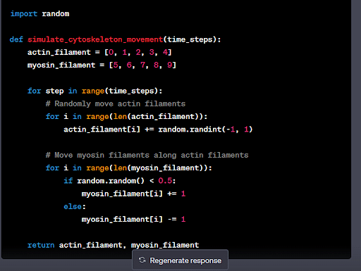

### Design Sample Test Cases 

The blood groups of humans exhibit multiple alleles, meaning the blood
group can have different genotypes. We consider this case to predict the
blood group of a child. The prompt for ChatGPT for test automation is
"Test cases for testing the probability of the presence of a specific
blood group in a child. Consider a real-world scenario where the blood
group can have two genotypes".

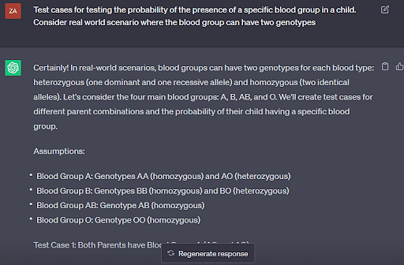

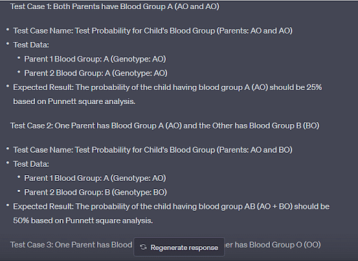

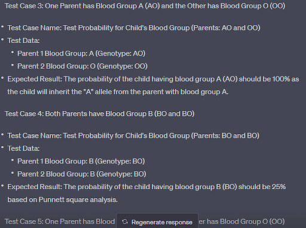

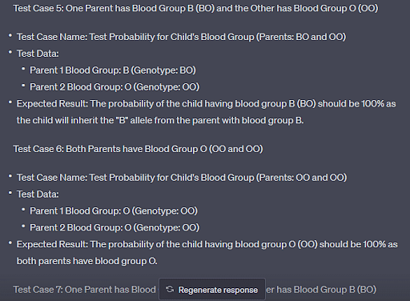

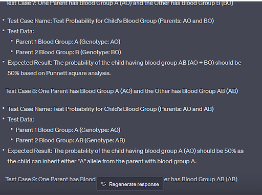

### Format Data

DNA sequences are stored in various formats. Our query was based on
FASTA and GenBank format. The former provides only the DNA sequence,
while the latter is associated with multiple other information. In
ChatGPT test automation for data formatting, the prompt was "Write a
program in Python and R to convert the DNA and protein sequences from
FASTA format to GenBank format simultaneously." ChatGPT provides a
separate program for each programming language for data/sequence
manipulation using specific libraries. 

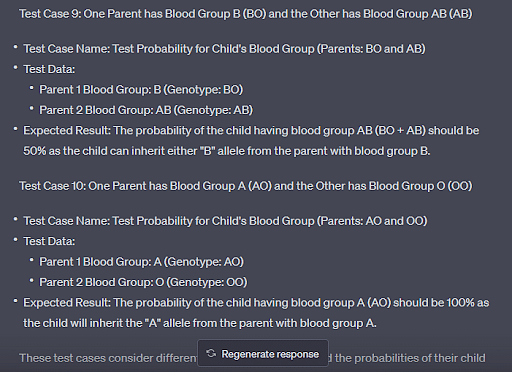

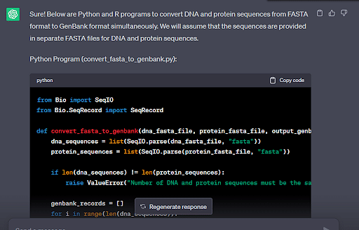

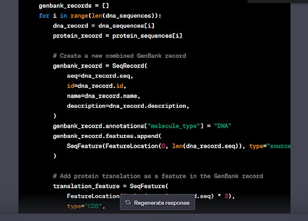

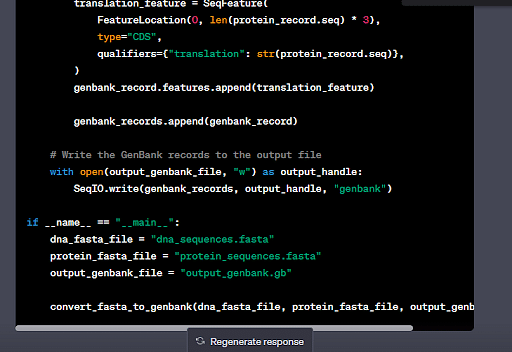

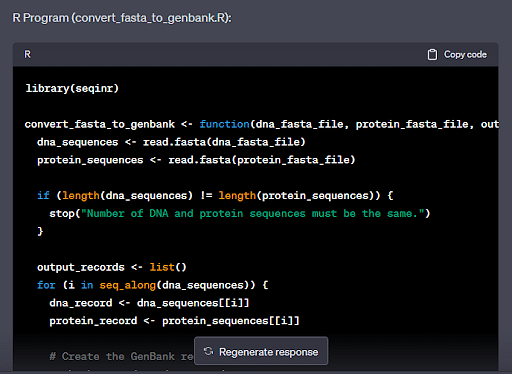

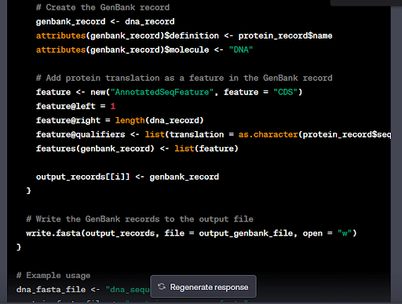

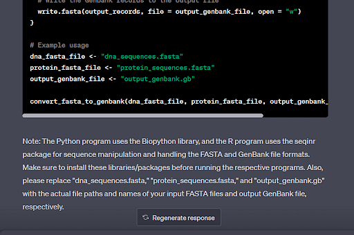

### Test Result Analysis

Mutations are changes in genetic sequences. Concerning their immense
importance, we request ChatGPT for automation testing to compare the
mutation frequency. Here is the prompt for the same "Analyze the results
of two random DNA sequences with different mutation rates. State the
frequency of different types of mutations in it". 

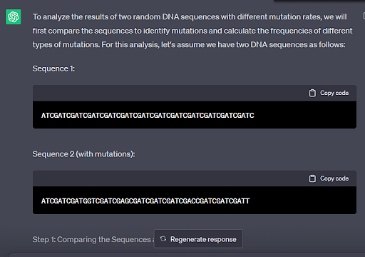

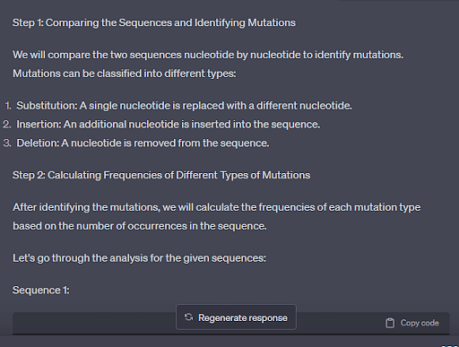

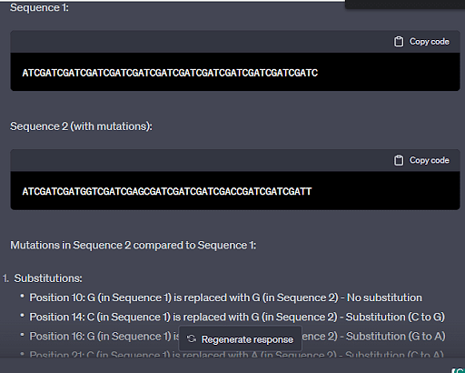

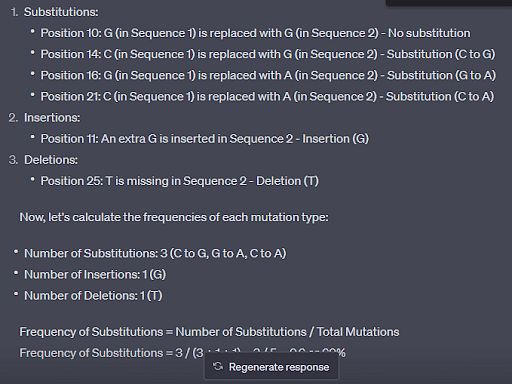

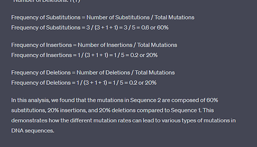

Best Practices for Utilizing ChatGPT in Test Automation
-------------------------------------------------------

Here are some tips to overcome the multiple challenges that a user may face while performing test automation:

- Be specific with keywords 
- Use ChatGPT itself to generate the ideas 
- Avoid sharing sensitive information or idea 
- Focus on the methodology of ChatGPT to develop answers and modify them accordingly 
- Ensure to provide context about your queries 
- Provide background information, specifically for the concerned
    domain
- Integrate ChatGPT with traditional automation toolkit
- Carefully consider possible biases by ChatGPT and check the results accordingly 

